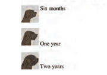
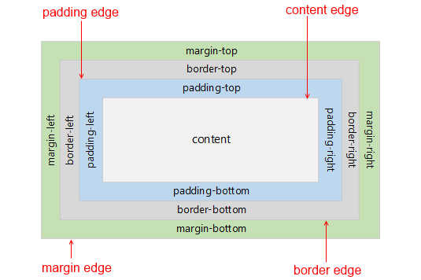
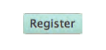
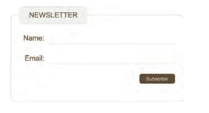
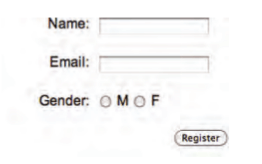

# CSS

---

## SNIPPETS


###  Alinear imagenes

```css
.imgV {
  vertical-align: middle;
}
.imgH {
  display: flex;
  margin: 0 auto;
  max-width: 100%;
}
```

### Enlaces animados y sin subrayar

```css
a, a:visited {
  text-decoration: none;
  color: #375EAB;
}
a:hover {
  color: lightblue;
}
div:hover {
  transform: scale(1.2);
}
```
* **Desactivar enlace**  
```css
a.notYet {
  pointer-events: none;
  text-decoration: line-through;
  color: #404040;
}
```

### hr gradual

```css
hr {
  margin: 10px 10% 10px 10%;
  border: 0;
  height: 1px;
  background: #333;
  background-image: linear-gradient(to right, #ccc, #888, #ccc);
}
```

### Problema en Chrome con la lista de puntos

```css
ul {
  text-align: center;
  /* para evitar los puntos */
  display: inline;
  /* poner los numeros en Chrome de listas ordenadas dentro del texto*/
  list-style-position: inside;
  list-style-type: none;
}

```

### Fijar pie al final de pantalla

```css
html {
  height: 100%;
  box-sizing: border-box;
}

*, *:before, *:after {
  box-sizing: inherit;
}

body {
  position: relative;
  margin: 0 auto;
  /*padding-bottom: 6rem;*/
  min-height: 97%;
}

.footer {
  position: absolute;
  right: 0;
  bottom: 0;
  left: 0;
  padding: 1rem;
  background-color: lightblue;
  text-align: center;
}
```

### Tamaño fuente como navegador

```css
html {
  font-size:16px;
}

/* 
Fijando el css en 16px y usando em despues conseguiremos resultados 
consistentes en firefox y chrome
*/

body {
  font-size:0.90em;
}

```


## **CSS3**

---

### INTRODUCCION

* **Enlaces a css**

Externo

```html
<head>
  <title>CSS Externo</title>
  <link href="css/estilo.css" type="text/css" rel="stylesheet" />
</head>
```

Si hay multiples hojas de estilo :

* `<link>` uno para cada hoja de estilo
* En la hoja de estilo que se enlaza incluir `@import url("estilo2.css);"`

Interno - NO USAR

```html
<head>
  <title>CSS Interno</title>
  <style type="text/css">
    body {
      font-family: calibri;
      background-color: green;}
    h1 {
      color: black;}
  </style>
</head>
```

#### **Selectores**

* **Selectores CSS**


* **Selectores de atributos**


#### **Cascada y herencia**

* **Cascada**

\- Ultima Regla: la ultima regla aplicada es la que manda  
\- `!important` añadiendo esto despues de la regla asi toma prioridad
```css
  color: blue !important;
```
\- Especificidad : prevalecera la regla del selector que sea mas especifico  
> `h3` es mas especifico que `*`  
> `p otro` es mas especifico que `p`  
> `p#intro` es mas especifico que `p`  

* **Herencia**

Casi todos los selectores anidados dentro de otros heredan las propiedades
asignadas al selector exterior. Por ejemplo un color en body tambien se
aplicara al texto de un parrafo.  

Hay excepciones evidentes como margin-top (un parrafo no tiene el mismo margen
superior que el body del documento).  

Puedes forzar heredar valores de propiedades de los padres usando `inherit` como
valor de la propiedad

```css
body {  
  padding: 20px;}  
.pagina {  
  padding: inherit;}  
```  

---

### COLOR

`color` -  

```css
h1 {
	 color: DarkCyan;}                 /* color name */
h2 {
	 color: #ee3e80;}                  /* hex code */
p {
	 color: rgb(100,100,90);}          /* rgb value */
```

`background color`-

```css
body {
	 background-color: rgb(150,150,150); }
h1 {
	 background-color: DarkCyan; }
h2 {
	 background-color: ##ee3e80: }
p {
	 background-color: red; }
```

`opacity`, `rgba`-  

```css
p.one {
	 background-color: rgb(0,0,0);
	 opacity: 0.5;}
p.two {
	 background-color: rgb(0,0,0);
	 background-color: rgba(0,0,0,0.5);}
```

---

### TEXTO

`cursor` - Controla el tipo de cursor del raton que se muestra
`auto|crosshair|default|pointer|move|text|wait|help|url("cursor.png")`  

```css
a {
  cursor: move;}
```

`font-family` - Familias : `serif`, `sans-serif`, `cursive`, `fantasy` y `monospace`  

```css
font-family: Arial, Verdana, sans-serif
```

`font-size` -

* Pixel: Por defecto en los navegadores el texto es de 16px
* Porcentaje : porcentaje sobre los 16px estandar, p.ej 75% es 12px
* em : unidad equivalente a la anchura de la m

`font-face` - 

```css
@font-face {
  font-family: 'PT Sans';
  src: url('_public/fonts/PTSans.ttf') ;
  font-display: fallback;
}

@font-face {
  font-family: 'ChunkFiveRegular';
  src: url('fonts/chunkfive.eot');
  src: url('fonts/chunkfive.eot?#iefix')	format('embedded-opentype'),
    url('fonts/chunkfive.woff') format('woff'),
    url('fonts/chunkfive.ttf') format('truetype'),
    url('fonts/chunkfive.svg#ChunkFiveRegular') format('svg');}
```

`font-weight` - `normal|bold`  

`font-style` - `normal|italic|oblique`  

`text-transform`- 

* uppercase : convierte el texto a mayusculas
* lowercase : convierte el texto a minusculas
* capitalize : pone mayusculas la primera letra de cada palabra

```css
h1 {
  text-transform: uppercase;}
```

`text-decoration`- 

* none : elimina cualquier decoracion del texto
* underline : subraya el texto
* overline : coloca una linea por encima del texto
* line-through : linea tachando el texto
* blink : hace que el texto brille y deje brillar

```css
a {
	 text-decoration: none;}
```

`line-height`- distancia entre lineas  

```css
p {
  line-height: 1.4em; }
```

`letter-spacing`, `word-spacing` - distancia entre letras, distancia entre palabras, por defecto es 0.25em  

```css
h1, h2 {
  text-transform: uppercase;
  letter-spacing: 0.2em; }
.credits {
  font-weight: bold;
  word-spacing: 1em; }
```

`text-align`- 

* left : el texto se alinea a la izquierda
* right : el texto se alinea a la derecha
* center : el texto se centra
* justify : Cada linea excepto la ultima ocupa toda la anchura disponible

```css
h1 {
  text-align: left; }
```

`vertical-align`- 

Usada con elementos en linea como `` `<em>` `<strong>` y es muy similar al
atributo `align` de ``

Valores :
`baseline`, `sub`, `super`, `top`, `text-top`, `middle`, `bottom`, `text-bottom`



```css
#six-months {
  vertical-align: text-top;}
#one-year {
  vertical-align: baseline;}
#two-years {
  vertical-align: text-bottom;}
```

`text-indent`- indenta el texto  

```css
h2 {
  text-indent: 20px; }
```

`text-shadow` - 

1. distancia a izda o dcha de la sombra
2. distancia arriba o abajo de la sombra
3. (opcional) cantidad de difuminado de la sombra
4. color de la sombra

```css
p {
  text-shadow: 2px 2px 1px #222222}
```

`:first-letter`, `:first-line` (pseudo-elementos) -  Para especificar diferentes valores a la primera letra o primera linea del texto    

```css
p.intro:first-letter {
  font-size: 200%;}
p.intro:first-line {
  font-weight: bold;}
```

`:link`, `:visited` (pseudo-clases) - Los navegadores muestran los enlaces en azul y subrayados por defecto y cambian el color cuando han sido visitados  

* :link : para poner estilos a enlaces no visitados
* :visited : para poner estilos a enlaces visitados

```css
a:link {
  color: deeppink;
  text-decoration: none;}
a:visited {
  color: black;}
a:hover {
  color: deeppink;
  text-decoration: underline;}
a:active {
  color: darkcyan;}
```

`:hover`, `:active`, `:focus` (pseudo-clases) - 

* :hover : se aplica cuando el raton esta encima (no funciona en tactiles)
* :active : se aplica cuando se pulsa algo
* :focus : se aplica cuando el elemento tiene el foco

```css
cajetinTexto {
  padding: 6px 12px 6px 12px;
  border: 1px solid #665544;
  color: #ffffff;}
boton.submit:hover {
  background-color: #665544;}
boton.submit:active {
  background-color: chocolate;}
cajetinTexto.text {
  color: #cccccc;}
cajetinTexto.text:focus {
  color: #665544;}
```

---

### BOXES

* **Dimensiones**

`width`, `height`- Por defecto las cajas tienen el tamaño justo para contener a su elemento. Podemos establecer nosotros ese tamaño usando  `pixeles`, o `porcentajes` relativos a la ventana del navegador o a la caja en que ya esta
si esta dentro de otra caja, o `ems`    

```css
div.box {
  height: 300px;
  width: 300px;
  background-color: #bbbbaa;}
```

`min-width`, `max-width` - Minimo y maximo anchura que una caja de un elemento puede tener  

`min-height`, `max-height`- Minimo y maximo anchura que una caja de un elemento puede tener  

`overflow`- Indica como actuar si el contenido dentro de la caja es mayor que la caja.  

* hidden : el contenido extra que no cabe sencillamente se esconde  
* scroll : aparece un scroll para acceder a ese contenido extra

```css
p.one {
  overflow: hidden;}
p.two {
  overflow: scroll;}
```

* **Visibilidad**

`display`- Permite convertir un elemento en linea en un bloque o al reves. Tambien vale para esconder un elemento en la pagina  

* inline : convierte un elemento de bloque en un elemento en linea
* block : convierte un elemento en linea en un elemento de bloque
* inline-block : permite a un elemento de bloque fluir como un elemento en
linea pero manteniendo las caracteristicas de un elemento de bloque
* none : esconde el elemento de la pagina

```css
li {
  display: inline;
  margin-right: 10px;}
li.coming-soon {
  display: none;}
```

`visibility`- Permite esconder cajas pero deja un espacio donde se supone que esta  

* hidden : esconde el elemento
* visible : muestra el elemento

```css
li.coming-soon {
	 visibility: hidden;}
```

`box-shadow`- 

1. distancia a izda o dcha de la sombra
2. distancia arriba o abajo de la sombra
3. (opcional) cantidad de difuminado del borde. Con cero la sombra es una linea
solida
4. Extension de la sombra, positiva hacia fuera, negativa hacia dentro

```css
p {
  box-shadow: 2px 2px 1px 5px #777777}
```

* **Bordes**

`border-padding-margin`- 



`border-width` - espesor de la linea de borde `thin|medium|thick`.  
`border-top-width`, `border-right-width`, `border-bottom-width`  `border-left-width` en orden de las agujas del reloj empezando por top   

```css
p.one {
  border-width: 2px;}
p.two {
  border-width: thick;}
p.three {
  border-width: 1px 4px 12px 4px;}
```

`border-style`- define el tipo de borde `solid|dotted|dashed|double|groove|ridge|inset|outset|hidden/none`.  
`border-top-style ...` - Puedes elegir bordes individuales  

```css
p.one {border-style: dashed;}
```

`border-color` - elegir color para el borde  
`border-top-color ...` - Tambien se puede elegir el color para cada borde  

```css
p.one {
  border-color: #0088dd;}
p.two {
  border-color: #bbbbaa blue orange #0088dd;}
```

`border-image`- Permite usar imagenes como bordes de las cajas  

`border-radius` -  
`border-top-right-radius` -  
`border-bottom-right-radius` -   
`border-bottom-left-radius` -  
`border-top-left-radius` -  

```css
p {
  border-radius: 5px, 10px, 5px, 10px; }
p.one {
  border-radius: 80px 50px; }
p.two  {
  border-top-left-radius: 80px 50px;}
```

* **Margenes**

`margin` - Espacio entre el borde y la caja. Lo normal en px aunque tambien se puede en ems o porcentajes.  
Si dos cajas se solapan usaremos el mayor de los dos margenes y el otro no  
Tambien individualmente para cada lado `margin-top, margin-right ...`  

```css
p.example1 {
  margin: 10px 2px 10px 5px;
p.example2 {
  margin: 10px;}
```

`padding`- Espacio entre el borde y el contenido. Lo normal es en px pero se pueden usar ems o porcentajes (% de la ventana del navegador o de la caja donde este contenido el elemento).  
Existen tambien individualmente para cada lado `padding-top, padding-right ...`

```css
p.example1 {
  padding: 10px 2px 10px 5px;
p.example2 {
  padding: 10px;}
```

`centrando contenido` - Para centrar una caja en la pagina ( o centrarla dentro del elemento en el que esta  
> 1. Establecer una `width` para la caja (sino tomara toda la anchura de la
> pagina)
> 2. Poner `margin-left: auto` y `margin-rigth: auto`

```css3
p {
  width: 300px;
  padding: 50px;
  border: 20px solid #0088dd;}
p.example {
  margin: 10px auto 10px auto;
```

---

### LISTAS

`list-style` - Permite declaras las siguientes opciones `type, imagen y position` en cualquier orden.  

```css
ul {
  list-style: inside circle; }
```

`list-style-type` - Para poner el estilo al marcador de las listas  

\- Listas ordenadas `decimal|decimal-leading-zero|lower-alpha|upper-alpha|lower-roman|upper-roman`  
\- Listas desordenadas `none|disc|circle|square`

```css
ol {
  list-style-type: lower-roman;}
```

`list-style-imagen` - Usar una imagen como marcador de listas. Se puede usar en `<ul>` y `<li>`  

```css
ul {
  list-style-image: url("images/star.png");}
```

`list-style-position` - Por defecto el marcador de lista aparece `outside` del indentado de la lista. Podemos cambiarlo por `inside` para que el marcador entre en la caja del texto el cual esta indentado  

```css
ul.t1 {
  list-style-position: outside;}
ul.t2 {
  list-style-position: inside;}
```

---

### TABLAS

Consejos:

* Diferenciar cabeceras en negrita, mayusculas o algo mas
* Oscurecer filas alternativas
* Columnas con numeros alinearlos a la derecha

`width` : poner la anchura de la tabla `<table>`  
`padding` : de las celdas `<th> y <td>`  
`text-transform` : en las cabeceras `<th>`  
`letter-spacing, font-size` : para diferenciar el texto de las cabeceras `<th>`  
`border-top, border-bottom` : para fiferenciar los bordes de la cabecera `<th>`  
`text-align `: para alinear el texto de las celdas a conveniencia `<th> <td>`  
`background-color` : cambiar el color de fondo alternando filas  
`:hover` : iluminar la fila con el puntero encima  

```css
body {
  font-family: Arial, Verdana, sans-serif;
  color: #111111;}
table {
  width: 600px;}
th, td {
  padding: 7px 10px 10px 10px;}
th {
  text-transform: uppercase;
  letter-spacing: 0.1em;
  font-size: 90%;
  border-bottom: 2px solid #111111;
  border-top: 1px solid #999;
  text-align: left;}
tr.even {
  background-color: #efefef;}
tr:hover {
  background-color: #c3e6e5;}
.money {
  text-align: right;}
```

`empty-cells` - `show|hide|inherit` indicar en las celdas vacias si mostramos los bordes o no o hereda el comportamiento de la tabla que le contiene   

```css
table.one {
  empty-cells: show;}
table.two {
  empty-cells: hide;}
```

`border-spacing` ajusta la distancia entre celdas adyacentes, por defecto es
minima. Se pone en px. Si pones dos valores son la separacion horizontal y la
vertical  
`border-collapse` los bordes se juntan en un solo borde

```css
table.one {
  border-spacing: 5px 15px;}
table.two {
  border-collapse: collapse;}
```

---

### FORMULARIOS

* **Dar estilo a entradas de texto**

```css
input {
  font-size: 120%;                // tamaño del texto 
  color: #5a5854;                 // color del texto
  background-color: #f2f2f2;      // color del fondo de la entrada 
  border: 1px solid #bdbdbd;      // marca los bordes de la entrada 
  border-radius: 5px;             // redondea esos bordes
  padding: 5px 5px 5px 30px;
  background-repeat: no-repeat;
  background-position: 8px 9px;
  display: block;
  margin-bottom: 10px;}
input:focus {                     // cambia el color de fondo 
  background-color: #ffffff;
  border: 1px solid #b1e1e4;}
input#email {
  background-image: url("images/email.png");}
input#twitter {
  background-image: url("images/twitter.png");}
input#web {
  background-image: url("images/web.png");}
```


* **Dar estilo a botones submit**

```css
input#submit {
  color: #444444;                     // color del texto del boton
  text-shadow: 0px 1px 1px #ffffff;   // apariencia 3d
  border-bottom: 2px solid #b2b2b2;   // para el borde del boton
  background-color: #b9e4e3;
  background: -webkit-gradient(linear, left top,
    left bottom, from(#beeae9), to(#a8cfce));
  background:
    -moz-linear-gradient(top, #beeae9, #a8cfce);
  background:
    -o-linear-gradient(top, #beeae9, #a8cfce);
  background:
    -ms-linear-gradient(top, #beeae9, #a8cfce);}
input#submit:hover {                // cambia la apariencia del boton 
  color: #333333;                   // al pasar por encima
  border: 1px solid #a4a4a4;
  border-top: 2px solid #b2b2b2;
  background-color: #a0dbc4;
  background: -webkit-gradient(linear, left top,
    left bottom, from(#a8cfce), to(#beeae9));
  background:
    -moz-linear-gradient(top, #a8cfce, #beeae9);
  background:
    -o-linear-gradient(top, #a8cfce, #beeae9);
  background:
    -ms-linear-gradient(top, #a8cfce, #beeae9);}
```



* **Poner estilo a fieldsets y legends**

```css
fieldset {
  width: 350px;               // controlar el tamaño del form
  border: 1px solid #dcdcdc;
  border-radius: 10px;
  padding: 20px;
  text-align: right;}
legend {
  background-color: #efefef;  // color de fondo
  border: 1px solid #dcdcdc;
  border-radius: 10px;
  padding: 10px 20px;
  text-align: left;
  text-transform: uppercase;}
```




* **Alinear formularios**

```css
div {
  border-bottom: 1px solid #efefef;
  margin: 10px;
  padding-bottom: 10px;
  width: 260px;}
.title {
  float: left;
  width: 100px;
  text-align: right;
  padding-right: 10px;}
.radio-buttons label {
  float: none;}
.submit {
  text-align: right;}
```



---

### LAYOUT


* **Tipos posicionamiento**

`position: static` normal o estatico es el usado por defecto. Los elementos de bloque se ponen uno a continuacion de otro ocupando todo el ancho de la ventana del navegador salvo que lo limite con `width.  

`position: relative` - Los elementos se posicionan en relacion a donde deberian estar en posicion normal.  
Los desplazamos dando valor a `top, bottom, left, right`. Estos valores se ponen en px, porcentajes o ems  

```css
p.example {
  position: relative;
  top: 10px;
  left: 100px;}
```

`position: absolute` - El elemento se posiciona de forma absolita respecto a su elemento contenedor y el resto de elementos de la pagina le ignoran  

```css
h1 {
  position: absolute;
  top: 0px;
  left: 500px;
  width: 250px;}
```

`position: fixed` - Como el absoluto pero el elemento ahora es inamovible, su posicion permanece igual independiente del resto de elemntos e incluso si se sube o baja en la ventana del navegador.  
Util para hacer menus fijos por ejemplo en la parte superior de la ventana  

```css
h1 {
  position: fixed;
  top: 0px;
  left: 50px;
  padding: 10px;
  margin: 0px;
  width: 100%;
  background-color: #efefef;}
```

`position: inherit`, hereda la posicion del padre  

`float: left|right` - Desplaza los elementos todo lo que puede hacia la dcha o izda segun la propiedad `float`.   
Cualquier otro elemento dentro del elemento contenedor fluira alrededor del
elemento que flota  

```css
blockquote {
   float: right;
   width: 275px;
   font-size: 130%;
   font-style: italic;
   font-family: Georgia, Times, serif;
   margin: 0px 0px 10px 10px;
   padding: 10px;
   border-top: 1px solid #665544;
   border-bottom: 1px solid #665544;}
```

* **propiedades de apoyo**

`clear: left|right|both|none` - indica que ningun otro elemento del mismo
contenedot debe tocar el lado indicado de ese elemento  

```css
.clear {
  clear: left;}
```

`overflow: auto; width:100%` - Si todos los elemento de un contenedor son flotantes puede hacer problemas en ciertos navegadores a la hora de mostrar los bordes  

```css
div {
  border: 1px solid #665544;
  overflow: auto;
  width: 100%;}
```

`multicolumna` - Crear diseños multicolumna con floats. Usar un `<div>` para cada columna y con las siguientes propiedades `width`, `float` y `margin` para cerrar un hueco entre las columnas  

`z-index` - Al usar posicionamiento relativo, fijo o absoluto los elementos se pueden solapar. Si es asi el ultimo que aparece en el codigo HTML es el que se ve.  
Para controlar eso esta la propiedad `z-index`, se ve el elemento con el mayor
valor de esa propiedad  

```css
h1 {
  position: fixed;
  z-index: 10;}
```

* **Tipos de Layout**

* **Anchura fija**

La anchura se especifica en pixeles (a veces tambien la altura)


```css
body {
  width: 960px;
  margin: 0 auto;}
#content {
  overflow: auto;
  height: 100%;}
#nav, #feature, #footer {
  background-color: #efefef;
  padding: 10px;
  margin: 10px;}
.column1, .column2, .column3 {
  background-color: #efefef;
  width: 300px;
  float: left;
  margin: 10px;}
li {
  display: inline;
  padding: 5px;}
```

* **Liquidos**

La anchura se especifica en porcentajes.

* `<body>` 90% de anchura
* cada columna se le pone un `margin: 1%`
* `min-width, max-width` para limitar los estiramientos


```css
body {
  width: 90%;
  margin: 0 auto;}
#content {overflow: auto;}
#nav, #feature, #footer {
  margin: 1%;}
.column1, .column2, .column3 {
  width: 31.3%;
  float: left;
  margin: 1%;}
.column3 {margin-right: 0%;}
li {
  display: inline;
  padding: 0.5em;}
#nav, #footer {
  background-color: #efefef;
  padding: 0.5em 0;}
#feature, .article {
  height: 10em;
  margin-bottom: 1em;
  background-color: #efefef;}
```

* **Diseño 960px**


---

### IMAGENES

* **Controlar tamaño**

Creas tres clases de imagenes, pequeñas, medianas y grandes. Despues a cada
imagen le pones la clase a la que pertenece y asi automaticamente se pone a ese
tamaño

```css
img.large {
  width: 500px;
  height: 500px;}
img.medium {
  width: 250px;
  height: 250px;}
img.small {
  width: 100px;
  height: 100px;}
```

* **Alinear imagenes**

Se recomienda usar `float` en lugar de `align`. Creamos clases `align-left`
`align-right` y luego a las imagenes les añadimos la clase que nos interese

```css
img.align-left {
  float: left;
  margin-right: 10px;}
img.align-right	{
  float: right;
  margin-left: 10px;}
```

* **Centrar imagenes**

Debemos convertir la imagen en en elemento de bloque y luego usar `margin`

```css
img.align-center {
  display: block;
  margin: 0px auto;}
```

* **background**

`background` - Orden de las propiedades:

1. background-color
2. background-image
3. background-repeat
4. background-attachment
5. background-position

```css
body {
  background: #ffffff url("images/tulip.gif") no-repeat top right;}
```

`background-image` - la imagen se ponde de fondo del elemento al que se lo asignamos

```css
p	{
  background-image: url("images/pattern.gif");}
```

`background-repeat`- 

* `repeat` la imagen se repite horizontal y verticalmente
* `repeat-x` la imagen solo se repite horizontalmente
* `repeat-y` la imagen solo se repite verticalmente
* `no-repeat` la imagen se muestra solo una vez

```css
body {
  background-image: url("images/header.gif");
  background-repeat: repeat-x;}
```

`background-attachment`- 

* `fixed` la imagen permanece fija
* `scroll` la imagen se mueve con el scroll

```css
body {
  background-image: url("images/tulip.gif");
  background-repeat: no-repeat;
  background-attachment: fixed;}
```

`background-position`- Para especificar donde sale una imagen que no se repite.
La propiedad tiene dos valores: Si solo se indica uno el segundo valor sera `center`. Tambien se puede usar px o porcentajes   

1. posicion horizontal `left|center|right`
2. posicion vertical `top|center|bottom`

```css
body {
  background-image: url("images/tulip.gif");
  background-repeat: no-repeat;
  background-position: center top;}
body {
  background-image: url("images/tulip.gif");
  background-repeat: no-repeat;
  background-position: 50% 50%;}
```

* **rollover y sprites**

Enlaces o botones que tienen un segundo estilo al ponerse el puntero encima y un
tercer estilo al pincharlos.

Se usan `sprites` que son una sola imagen con diferentes partes a usar.


```html
<a class="button" id="add-to-basket">Add to basket</a>
<a class="button" id="framing-options">Framing options</a>
```

```css
a.button {
  height: 36px;
  background-image: url("images/sprite.png");
  text-indent: -9999px;
  display: inline-block;}
a#add-to-basket {
  width: 174px;
  background-position: 0px 0px;}
a#framing-options {
  width: 210px;
  background-position: -175px 0px;}
a#add-to-basket:hover {
  background-position: 0px -40px;}
a#framing-options:hover {
  background-position: -175px -40px;}
a#add-to-basket:active {
  background-position: 0px -80px;}
a#framing-options:active {
  background-position: -175px -80px;}
```

---

### TRANSITION

```css3
.tecla {
  color: deepskyblue;
  background: rgba(0, 0, 0, 0.4);
  text-shadow: 0 0 1px black;
  transition: background-color 0.2s;
}
.pulsada {
  background-color: orange;
  transform: scale(1.1, 1.1);
}
```

```html
<div class="tecla" id="0">A<span class="sonido">clap</span></div>
```

```javascript
function pressKey (e) {
  var valor = mapa.indexOf(e.key.toUpperCase());
  if (valor !== -1) {
    document.getElementById(valor).addEventListener('transitionend',
      function () {
        document.getElementById(valor).classList.remove('pulsada');
      });
    document.getElementById(valor).classList.add('pulsada');
    audio[valor].play();
  }
}
```

---
