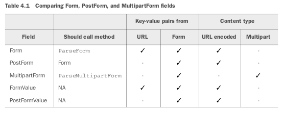

# GOLANG PARA DESARROLLO WEB  

---

## NET/HTTP

`import net/http`    

### Static

```go
// sirve el directorio entero
func main() {		
	dir := http.Dir("./files")
	http.ListenAndServe(":8080", http.FileServer(dir))
	http.HandleFunc("/", readme)
}
```

```go
// ServeFile sirve un archivo o un directorio como 3er argumento
func main() {
	http.HandleFunc("/", public)
	http.ListenAndServe(":8080", nil)
}
func public(w http.ResponseWriter, r *http.Request) {
	http.ServeFile(w, r, "./files/hola.html")
	//	http.ServeFile(w, r, "./files/")
}
```

```go
// sirve el directorio ./files en la ruta /static/
// ./files puede estar en cualquier sitio del sistema de archivos
// no solo en el dir de la aplicacion
func main() {
	dir := http.Dir("./files/")
	handler := http.StripPrefix("/static/", http.FileServer(dir))
	http.Handle("/static/", handler)

	http.HandleFunc("/", homePage)
	http.ListenAndServe(":8080", nil)
}
```

### Handler

\- Handlers son cualquier struct que tiene un metodo `ServeHTTP(w http.ResponseWriter, r *http.Request)` con dos parametros: una interface HTTPResponseWriter y un puntero a una Request struct.  
\- Handler functions son funciones que se comportan como handlers. Tienen la misma firma que el metodo ServeHTTP y se utiizan para procesar peticiones (Requests)  
\- Handlers y handler functions se pueden encadenar para permitir el procesado en partes de peticiones mediante la separacion de asuntos.  
\- Multiplexers(routers) tambien son handlers. ServeMux es un router de peticiones HTTP. Acepta peticiones HTTP y las redirige al handler adecuado segun la URL de la peticion.  
`DefaultServeMux` es una instancia de `ServeMux` que se usa como router por defecto
 

* **Handler**

```go
// multi handler and chain handler
package main

import (
	"fmt"
	"net/http"
)

type helloHandler struct{}

func (h *helloHandler) ServeHTTP(w http.ResponseWriter, r *http.Request){
	fmt.Fprintf(w, "Hello!")
}

type worldHandler struct{}

func (h *worldHandler) ServeHTTP(w http.ResponseWriter, r *http.Request){
	fmt.Fprintf(w, "World!")
}

func log(h http.Handler) http.Handler {
	return http.HandlerFunc(func(w http.ResponseWriter, r *http.Request){
		fmt.Printf("Handler called - %T\n", h)
		h.ServeHTTP(w, r)
	})
}

func protect(h http.Handler) http.Handler {
	return http.HandlerFunc(func(w http.ResponseWriter, r *http.Request){
		// some code to make sure the user is authorized
		h.ServeHTTP(w, r)
	})
}

func main() {
	hello := helloHandler{}
	world := worldHandler{}

	server := http.Server{
		Addr: "127.0.0.1:8080",
	}

	http.Handle("/hello", protect(log(&hello)))
	http.Handle("/world", &world)

	server.ListenAndServe()
}
```

* **HandleFunc**

```go 
package main

import (
	"fmt"
	"net/http"
	"reflect"
	"runtime"
)

func hello(w http.ResponseWriter, r *http.Request) {
	fmt.Fprintf(w, "Hello!")
}

func world(w http.ResponseWriter, r *http.Request) {
	fmt.Fprintf(w, "World!")
}

func log(h http.HandlerFunc) http.HandlerFunc {
	return func(w http.ResponseWriter, r *http.Request) {
		name := runtime.FuncForPC(reflect.ValueOf(h).Pointer()).Name()
		fmt.Println("Handler function called - " + name)
		h(w, r)
	}
}

func main() {
	server := http.Server{
		Addr: "127.0.0.1:8080",
	}
	http.HandleFunc("/hello", log(hello))
	http.HandleFunc("/world", world)

	server.ListenAndServe()
}
```

### Request

* **URL**

```go
https://golang.org/src/net/url/url.go
type URL struct {
	Scheme     string
	Opaque     string    // encoded opaque data
	User       *Userinfo // username and password information
	Host       string    // host or host:port
	Path       string
	RawPath    string // encoded path hint 
	ForceQuery bool   // append a query ('?') even if RawQuery is empty
	RawQuery   string // encoded query values, without '?'
	Fragment   string // fragment for references, without '#'
}
algunos metodos
// EscapedPath returns the escaped form of u.Path.
func (u *URL) EscapedPath() string {}
// IsAbs reports whether the URL is absolute.
func (u *URL) IsAbs() bool {}
// Query parses RawQuery and returns the corresponding values.
func (u *URL) Query() Values {}
type Values map[string][]string
```

* **Headers**

`type Header`  
`func (h Header) Add(key, value string)`  
`func (h Header) Del(key string)`  
`func (h Header) Get(key string) string`  
`func (h Header) Set(key, value string)`  
`func (h Header) Write(w io.Writer) error`  
`func (h Header) WriteSubset(w io.Writer, exclude map[string]bool) error`  

```go
func headers(w http.ResponseWriter, r *http.Request) {
	h := r.Header
	// h := r.Header["Accept-Encoding"]  // devuelve un map de strings
	// h := r.Header.Get("Accept-Encoding") // devuelve string
	fmt.Fprintln(w, h)
}
http.HandleFunc("/headers", headers)
```


* **Body**

```go

func body(w http.ResponseWriter, r *http.Request) {
	len := r.ContentLength
	body := make([]byte, len)
	r.Body.Read(body)
	fmt.Fprintln(w, string(body))
}
	http.HandleFunc("/body", body)
```

### ResponseWriter

La interface `ResponseWriter` tiene tres metodos:  
\- `Write` - coge un []bytes y lo escribe en el body de la respuesta HTTP. Si la cabecera no especifica content-type usa los los primeros 512 bytes de datos para detectar el tipo de contenido   
\- `WriteHeader` - envia un numero entero que representa el codigo de estado de la respuesta HTTP. Despues de usar este metodo no se puede escribir ni modificar nada en la cabecera. Si no se use este metodo por defecto cuando se llama a `Write` se envia el codigo `200 OK`  
Es muy util para enviar codigos de errores  
\- `Header` - devuelve un map de campos de la cabecera que se pueden modificar y que seran enviados en la respuesta al cliente  

```go
type post struct {
	User    string
	Langs []string
}

func writeExample(w http.ResponseWriter, r *http.Request) {
	str := `<html>
<head><title>Write Example</title></head>
<body><h1>Hello World</h1></body>
</html>`
	w.Write([]byte(str))
}

func writeHeaderExample(w http.ResponseWriter, r *http.Request) {
	w.WriteHeader(501)
	fmt.Fprintln(w, "Not implemented yet")
}

func headerExample(w http.ResponseWriter, r *http.Request) {
	w.Header().Set("Location", "https://jolav.github.io")
	w.WriteHeader(302)
}

func jsonExample(w http.ResponseWriter, r *http.Request) {
	w.Header().Set("Content-Type", "application/json")
	post := &post{
		User:    "jolav",
		Langs: []string{"Go", "HTML", "Javascript"},
	}
	json, _ := json.Marshal(post)
	w.Write(json)
}

func main() {
	server := http.Server{
		Addr: "127.0.0.1:8080",
	}
	http.HandleFunc("/write", writeExample)
	http.HandleFunc("/writeheader", writeHeaderExample)
	http.HandleFunc("/redirect", headerExample)
	http.HandleFunc("/json", jsonExample)
	server.ListenAndServe()
}
```

### Middleware

```go
type Middleware []http.Handler

// Adds a handler to the middleware
func (m *Middleware) Add(handler http.Handler) {
    *m = append(*m, handler)
}
func (m Middleware) ServeHTTP(w http.ResponseWriter, r *http. ➥Request) {
  // Process the middleware
}
```

### Cookies

```go
https://golang.org/src/net/http/cookie.go

type Cookie struct {
	Name  			string
	Value 			string
	Path     	  string    // optional
	Domain      string    // optional
	Expires     time.Time // optional
	RawExpires  string    // for reading cookies only
	// MaxAge=0 means no 'Max-Age' attribute specified.
	// MaxAge<0 means delete cookie now, equivalently 'Max-Age: 0'
	// MaxAge>0 means Max-Age attribute present and given in seconds
	MaxAge   		int
	Secure   		bool
	HttpOnly 		bool
	Raw      		string
	Unparsed 		[]string // Raw text of unparsed attribute-value pairs
}
```

Si no se usa el campo `Expires` la cookie es de sesion o temporal y se eliminan del navegador cuando este se cierra. De lo contrario la cookie es persistente y dura hasta que expire o se elimine. Usar `MaxAge` en lugar de `Expires` que esta deprecada  

```go
package main

import (
	"encoding/base64"
	"fmt"
	"net/http"
	"time"
)

func setCookie(w http.ResponseWriter, r *http.Request) {
	c1 := http.Cookie{
		Name:     "first cookie",
		Value:    "Valor de la primera galleta",
		HttpOnly: true,
	}
	c2 := http.Cookie{
		Name:     "second cookie",
		Value:    "Valor de la segunda galleta",
		HttpOnly: true,
	}
	http.SetCookie(w, &c1)
	http.SetCookie(w, &c2)
}

func getCookie(w http.ResponseWriter, r *http.Request) {
	c1, err := r.Cookie("first cookie")
	if err != nil {
		fmt.Fprintln(w, "Cannot get the first cookie")
	}
	cs := r.Cookies()
	fmt.Fprintln(w, c1)
	fmt.Fprintln(w, cs)
}

func setMessage(w http.ResponseWriter, r *http.Request) {
	msg := []byte("Hello World!")
	c := http.Cookie{
		Name:  "flash",
		Value: base64.URLEncoding.EncodeToString(msg),
	}
	http.SetCookie(w, &c)
}

func showMessage(w http.ResponseWriter, r *http.Request) {
	c, err := r.Cookie("flash")
	if err != nil {
		if err == http.ErrNoCookie {
			fmt.Fprintln(w, "No message found")
		}
	} else {
		rc := http.Cookie{
			Name:    "flash",
			MaxAge:  -1,
			Expires: time.Unix(1, 0),
		}
		http.SetCookie(w, &rc)
		val, _ := base64.URLEncoding.DecodeString(c.Value)
		fmt.Fprintln(w, string(val))
	}
}

func main() {
	server := http.Server{
		Addr: "127.0.0.1:8080",
	}
	http.HandleFunc("/setCookie", setCookie)
	http.HandleFunc("/getCookie", getCookie)
	http.HandleFunc("/setMessage", setMessage)
	http.HandleFunc("/showMessage", showMessage)
	server.ListenAndServe()
}
```

### Sessions

### Forms

1º - Parseamos la peticion con `ParseForm o ParseMultipartForm`   
2º - Accedemos al formulario  

```html
// formulario para process1
<form action="http://127.0.0.1:8080/process1?hello=world&thread=123" 
method="post" enctype="application/x-www-form-urlencoded">
	<input type="text" name="hello" value="jolav" />
	<input type="text" name="post" value="1234" />
	<input type="submit" />
</form>
<!--
Obtendriamos map[thread:[123] hello:[jolav world] post:[1234]]
Tenemos los valores de la URL mas los del formulario
Para sacar solo un campo usamos notacion r.Form["post"] 

Si usamos r.PostForm se ignoran los pares de la URL y solo se usan los
del formulario resultando map[post:[1234] hello:[jolav]]

Tambien existe ParseMultipartForm  
-->
// formulario para process2 y process3
<form action="http://localhost:8080/process?hello=world&thread=123"
method="post" enctype="multipart/form-data">
	<input type="text" name="hello" value="jolav" />
	<input type="text" name="post" value="1234" />
	<input type="file" name="uploaded">
	<input type="submit">
</form>
```

```go
package main

import (
	"fmt"
	"io/ioutil"
	"net/http"
)

func process1(w http.ResponseWriter, r *http.Request) {
	r.ParseForm()
	fmt.Fprintln(w, r.Form["campo"][0])
	fmt.Prinltln(w, r.Form.Get("campo"))
	// 	fmt.Fprintln(w, r.PostForm)
}

func process2(w http.ResponseWriter, r *http.Request) {
	file, _, err := r.FormFile("uploaded")
	if err == nil {
		data, err := ioutil.ReadAll(file)
		if err == nil {
			fmt.Fprintln(w, string(data))
		}
	}
}

func process3(w http.ResponseWriter, r *http.Request) {
	r.ParseMultipartForm(1024)
	fileHeader := r.MultipartForm.File["uploaded"][0]
	file, err := fileHeader.Open()
	if err == nil {
		data, err := ioutil.ReadAll(file)
		if err == nil {
			fmt.Fprintln(w, string(data))
		}
	}
}

func main() {
	server := http.Server{
		Addr: "127.0.0.1:8080",
	}
	http.HandleFunc("/process1", process1)
	http.HandleFunc("/process2", process2)
	http.HandleFunc("/process3", process3)

	server.ListenAndServe()
}
```



### Cliente HTTP

`type Client`  
`func (c *Client) Do(req *Request) (*Response, error)`  
`func (c *Client) Get(url string) (resp *Response, err error)`  
`func (c *Client) Head(url string) (resp *Response, err error)`  
`func (c *Client) Post(url string, bodyType string, body io.Reader) (resp *Response, err error)`  
`func (c *Client) PostForm(url string, data url.Values) (resp *Response, err error)`  

Ejemplo Hacer peticiones `get`  

Poner en el main o donde sea para asegurarse que tiene un tiempo maximo de espera y no se queda colgado esperando hasta el infinito (que es el valor por defecto)
https://reddit.com/r/golang/comments/45mzie/dont_use_gos_default_http_client/

```go
http.DefaultClient.Timeout = 10 * time.Second
```

```go
func getHttpRequest() {
	url := "https://codetabs.com/tools/geoip/geoip.html" 
	resp, err := http.Get(url)
	if err != nil {
		log.Fatal(err)
	}
	defer resp.Body.Close()
	decoder := json.NewDecoder(resp.Body)
	err = decoder.Decode(&geo)
	if err != nil {
		panic(err)
	}
	aux.SendDataToClient(w, r, geo)
}
```  

### ServeMux

```go
func mainNormal() {
	// assets for all apps
	assets := http.FileServer(http.Dir("_public"))
	http.Handle("/", http.StripPrefix("/", assets))

	// assets for individual apps
	votingRes := http.FileServer(http.Dir("voting/assets"))
	http.Handle("/voting/assets/", 
		http.StripPrefix("/voting/assets/", votingRes))

	book := http.FileServer(http.Dir("./book/"))
	nightlife := http.FileServer(http.Dir("./nightlife/"))
	stock := http.FileServer(http.Dir("./stock/"))

	http.Handle("/book/", http.StripPrefix("/book", book))
	http.Handle("/nightlife/", http.StripPrefix("/nightlife", nightlife))
	http.Handle("/stock/", http.StripPrefix("/stock", stock))

	// any /voting/* will redirect to voting.Voting
	http.HandleFunc("/voting/", voting.Router)

	// any /pintelest/* will redirect to voting.Voting
	http.HandleFunc("/pintelest/", nodePintelest)

	server := http.Server{
		Addr: "localhost:3006",
	}
	server.ListenAndServe()
}
```

```go
func mainMux() {
	mux := http.NewServeMux()

	// assets for all apps
	assets := http.FileServer(http.Dir("_public"))
	mux.Handle("/", http.StripPrefix("/", assets))

	// assets for individual apps
	votingRes := http.FileServer(http.Dir("voting/assets"))
	mux.Handle("/voting/assets/", 
		http.StripPrefix("/voting/assets/", votingRes))

	book := http.FileServer(http.Dir("./book/"))
	nightlife := http.FileServer(http.Dir("./nightlife/"))
	stock := http.FileServer(http.Dir("./stock/"))

	mux.Handle("/book/", http.StripPrefix("/book", book))
	mux.Handle("/nightlife/", http.StripPrefix("/nightlife", nightlife))
	mux.Handle("/stock/", http.StripPrefix("/stock", stock))

	mux.HandleFunc("/voting/", voting.Router)
	//mux.HandleFunc("/voting/p/", nodePintelest)

	// any /pintelest/* will redirect to nodePintelest
	mux.HandleFunc("/pintelest/", nodePintelest)

	server := http.Server{
		Addr:    "localhost:3006",
		Handler: mux,
	}
	server.ListenAndServe()
}
```

```go
// http://codepodu.com/subdomains-with-golang/
type Subdomains map[string]http.Handler
func (subdomains Subdomains) ServeHTTP(w http.ResponseWriter, 
							r *http.Request) {
	domainParts := strings.Split(r.Host, ".")
	if mux := subdomains[domainParts[0]]; mux != nil {
		// Let the appropriate mux serve the request
		mux.ServeHTTP(w, r)
	} else {
		// Handle 404
		http.Error(w, "Not found", 404)
	}
}
type Mux struct {
	http.Handler
}
func (mux Mux) ServeHTTP(w http.ResponseWriter, r *http.Request) {
	mux.ServeHTTP(w, r)
}

func adminHandlerOne(w http.ResponseWriter, r *http.Request) {
	fmt.Fprintf(w, "It's adminHandlerOne , Hello, %q", r.URL.Path[1:])
}
func adminHandlerTwo(w http.ResponseWriter, r *http.Request) {
	fmt.Fprintf(w, "It's adminHandlerTwo , Hello, %q", r.URL.Path[1:])
}
func analyticsHandlerOne(w http.ResponseWriter, r *http.Request) {
	fmt.Fprintf(w, "It's analyticsHandlerOne , Hello, %q", r.URL.Path[1:])
}
func analyticsHandlerTwo(w http.ResponseWriter, r *http.Request) {
	fmt.Fprintf(w, "It's analyticsHandlerTwo , Hello, %q", r.URL.Path[1:])
}

func main() {
	adminMux := http.NewServeMux()
	adminMux.HandleFunc("/admin/pathone", adminHandlerOne)
	adminMux.HandleFunc("/admin/pathtwo", adminHandlerTwo)

	analyticsMux := http.NewServeMux()
	analyticsMux.HandleFunc("/analytics/pathone", analyticsHandlerOne)
	analyticsMux.HandleFunc("/analytics/pathtwo", analyticsHandlerTwo)

	subdomains := make(Subdomains)
	subdomains["admin"] = adminMux
	subdomains["analytics"] = analyticsMux

	http.ListenAndServe(":8080", subdomains)
}
```

---

## HTML/TEMPLATE

`import html/template`    

* Para usarlo hay que importar el paquete `html/template`
* crear la plantilla `t, _ := template.ParseFiles("index.html")`
* asignar valor a variables de plantilla `template_value := "Hola"`
* servir la pagina `t.Execute(w, template_values)`

index.html

```html
<!doctype html>
<html>
<head>
  <meta charset="utf-8">
  <title>Hello World</title>
</head>
<body>
Hello {{ . }}
</body>
</html>
```

pagina.go

```go
package main

import (
	"html/template"
	"net/http"
)

func handler(w http.ResponseWriter, r *http.Request) {
	t, _ := template.ParseFiles("index.html")
	name := "World"
	t.Execute(w, name)
}

func main() {
	http.HandleFunc("/", handler)
	http.ListenAndServe(":8080", nil)
}
```

### Fields

* `{{}}` cualquier cosa a ser renderizada debe ir entre dobles parentesis

* `{{.}}` abreviatura para el objeto actual

* `{{ .FieldName}}` campo FieldName del objecto actual

* Arrays and slices

```go
type Friend struct {
    Fname string
}

type Person struct {
    UserName string
    Emails   []string
    Friends  []*Friend
}

func main() {
    f1 := Friend{Fname: "minux.ma"}
    f2 := Friend{Fname: "xushiwei"}
    t := template.New("fieldname example")
    t, _ = t.Parse(`hello {{.UserName}}!
            {{range .Emails}}
                an email {{.}}
            {{end}}
            {{with .Friends}}
            {{range .}}
                my friend name is {{.Fname}}
            {{end}}
            {{end}}
            `)
    p := Person{UserName: "Astaxie",
        Emails:  []string{"astaxie@beego.me", "astaxie@gmail.com"},
        Friends: []*Friend{&f1, &f2}}
    t.Execute(os.Stdout, p)
}
```

* Arrays and slices index

```go
const tmpl = `
{{range $index, $link := .}}
{{$index}}: <a href="{{$link.Href}}">{{$link.Name}}</a>
{{end}}
`

type Link struct {
    Name string
    Href string
}

func main() {
  	// arrays
  	var la [2]Link
  	la[0] = Link{"Google", "https://www.google.com/"}
  	la[1] = Link{"Facebook", "https://www.facebook.com/"}
  	t, _ := template.New("foo").Parse(tmpl)
  	t.Execute(os.Stdout, la)

  	// slices
  	var ls []Link
  	ls = append(ls, Link{"Google", "https://www.google.com/"})
  	ls = append(ls, Link{"Facebook", "https://www.facebook.com/"})
  	t.Execute(os.Stdout, ls)
}
```

* Maps

```go
const tmpl = `
{{range $name, $href := .}}
<a href="{{$href}}">{{$name}}</a>
{{end}}
`

func main() {
  	// map
  	var m = map[string]string{
  	    "Google": "https://www.google.com/",
  	    "Facebook": "https://www.facebook.com/",
  	}
  	t, _ := template.New("foo").Parse(tmpl)
  	t.Execute(os.Stdout, m)
}
```

### Conditions

* {{if}} {{else}} : Solo para valores booleanos, no hace comparaciones

```go
{{if ``}}
    Will not print.
{{end}}
```

```go
{{if `anything`}}
    Will print.
{{end}}
```

```go
{{if `anything`}}
    Print IF part.  
{{else}}
  Print ELSE part.
{{end}}
```

### Pipelines

* {{ . | html}} Por ejemplo usamos esto para coger el objto actual '.' y
aplicarle escape a HTML al objeto


### Variables

Pasar variables a templates

```go
// usando anonymous structs
var templates = template.Must(template.ParseGlob("templates/*"))

func handle(w http.ResponseWriter, r *http.Request) {
	w.Header().Set("Content-Type", "text/html; charset=utf-8")
	templates.ExecuteTemplate(w, "page.html", struct {
		PageTitle string
		Message string
		User string
		}{"Template example: struct", "Hello", "World"})
}
```

```go
// usando Maps
var templates = template.Must(template.ParseGlob("templates/*"))

func handle(w http.ResponseWriter, r *http.Request) {
	w.Header().Set("Content-Type", "text/html; charset=utf-8")
	m := make(map[string]interface{})
	m["PageTitle"] = "Template example: map"
	m["Message"] = "Hello"
	m["User"] = "World"
	templates.ExecuteTemplate(w, "page.html", m)
}
```

```go
// mapa
m := map[string]interface{}{
	"imgs": imgs, // {{range .imgs.Image}}{{.}}{{end}}
	"user": p,    //{{.user.Name}}
}

// struct , Images []Image
type Data struct {
	I Images
	P Profile
}
var d Data
d.I = imgs // {{range .I.Image}}{{.}}{{end}}
d.P = p    // {{.P.Name}}*/
t.Execute(w, &m) 
```

### Funciones

#### Predefinidas

Por ejemplo `print` equivale a `fmt.Sprintf`

```go
func main() {
    texto := "{{with $x := `hello`}}{{printf `%s %s` $x `Mary`}}
        {{end}}!\n"
    t := template.New("test")
    t = template.Must(t.Parse(texto))
    t.Execute(os.Stdout, nil)
```

// Resultado -> hello Mary!

#### De Diseño

```go
const tmpl = `
<span>hello {{gettext .}}</span>
<span>hello {{. | gettext}}</span>
`

var funcMap = template.FuncMap{
    "gettext": gettext,
}

func gettext(s string) string {
  	if s == "world" {
  		  return "otraCosa"
  	}
  	return s
}

func main() {
  	t, _ := template.New("foo").Funcs(funcMap).Parse(tmpl)
  	s := "world"
  	t.Execute(os.Stdout, s)
}
```

### Must

Es una funcion del paquete template para validar plantillas

### Nested templates

* Se puede declarar una plantilla:  
> {{ define "sub-plantilla"}}   
>   contenido que sea  
> {{ end}}

* Luego esa plantilla se inserta
> {{ template "sub-plantilla" }}  

base.html

```html
{{define "base"}}
<!doctype html>
<html>
<head>
  <meta charset="utf-8">
  <title>{{template "title" .}}</title>
</head>
<body>
{{template "content" .}}
</body>
</html>
{{end}}
```

index.html

```html
{{template "base" .}}
{{define "title"}}my title{{end}}
{{define "content"}}
<div>hello {{.}}</div>
{{end}}
```

nestedTemplates.go

```go
func main() {
  	// cannot put base.html before index.html will give empty output
   	// t, _ := template.ParseFiles("base.html", "index.html")
  	t, _ := template.ParseFiles("index.html", "base.html")
  	name := "world"
  	t.Execute(os.Stdout, name)
}
```

### Pasar vars a js 

Pasar variables golang a cliente js

```html
<!-- guest.html-->
<script type="text/javascript">
  // Pass golang vars to client js
  //window.addEventListener('load', voting.init({{.}}))
  var golang = {{.}} // pasa como variable global objeto
  //var golang = "{{ .}}"; // lo pasa como string
  window.addEventListener('load', function () {
    voting.init()
  })
</script>
```

```go
// voting.go
func guest(w http.ResponseWriter, r *http.Request) {
	var data aPoll
	data = aPoll{Question: "Texto de la cuestion"}
	tmpl["guest.html"].ExecuteTemplate(w, "guest.html", data)
}
```

```javascript
var voting = (function () {
  function init () {
    console.log("Data from golang", golang);
  }
	return {
    init: init
  };
}());
```

---

## NET/URL

### Añadir parametros a URL

```go
// sobre una URL existente
values := r.URL.Query()
values.Add("nombreNuevoParamatro", valor)
values.Get("nombreDelValor", valor)
r.URL.RawQuery = values.Encode()
fmt.Println(r.URL.String())
fmt.Println(values["nombreNuevoParametro"])

// construyendo una URL
urlData, err := url.Parse("https://apisquesea.com/custom/v1?q=")
params := url.Values{}
params.Add("q", r.URL.Query().Get("q"))
params.Add("cx", c.APIImage.CseID)
params.Add("key", c.APIImage.Key)
params.Add("num", r.URL.Query().Get("num"))
params.Add("offset", r.URL.Query().Get("offset"))
urlData.RawQuery = params.Encode()
```

[URL parsing](https://gobyexample.com/url-parsing)  

---

## UTILIDADES  

### fresh

[https://github.com/pilu/fresh](https://github.com/pilu/fresh) - Especie de nodemon para golang.   

archivo de configuracion que se ejecuta con `fresh -c ruta/al/archivo`  

```sh
root:              .
tmp_path:          ./tmp
build_name:        runner-build
build_log:         runner-build-errors.log
valid_ext:         .go, .tpl, .tmpl, .html, .css, .js
ignored:           assets, tmp, pintelest
build_delay:       600
colors:            1
log_color_main:    cyan
log_color_build:   yellow
log_color_runner:  green
log_color_watcher: magenta
log_color_app:
```

---
