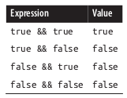
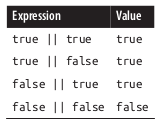
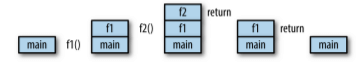

# GOLANG 1.14.X

---

## **INSTALACION**

[descargarlo de aqui](https://golang.org/dl/)

Como root  
`tar -C /usr/local -xzf go-file.tar.gz`

```sh
// como usuario
nano $HOME/.bashrc 
nano $HOME/.profile 

// añadir a cada uno

# Golang conf
export PATH=$PATH:/usr/local/go/bin
export GOPATH=$HOME/path/to/golang/code
export PATH=$PATH:$GOPATH/bin
// La siguiente linea hay veces que es necesaria
export GOBIN=$PATH:$GOPATH/bin
```

Para recargar la configuracion  
`source ~/.profile`   

Carpetas que se crean:  

* `bin` - Contiene los binarios compilados. Podemos añadir la carpeta `bin` al path del sistema para hacer los binarios compilados ejecutables desde cualquier  sitio  
* `pkg` - contiene los versiones compiladas de las librerias disponibles para
que el compilador las pueda enlazar sin tener que recompilarlas  
* `src` -  contiene todo el codigo organizado por rutas de import  


**VS Code**

`Go: Install/Update Tools`

---

## ENLACES UTILES

* **Go**

<code>[Interfaces](http://jordanorelli.com/post/32665860244/how-to-use-interfaces-in-go)</code>  
<code>[Tipos de funcion](http://jordanorelli.com/post/42369331748/function-types-in-go-golang)</code>  
<code>[Modulos](https://github.com/golang/go/wiki/Modules)</code>  
<code>[Ejemplos - gobyexample](https://gobyexample.com/)</code>  
<code>[Ejemplos - rosettacode](https://www.rosettacode.org/wiki/Category:Go)</code>  

<code>[GO MODULES en VSCODE](https://github.com/golang/go/wiki/gopls)</code>  
<code>[GO MODULES en VSCODE](https://github.com/Microsoft/vscode-go/wiki/Go-modules-support-in-Visual-Studio-Code)</code>  
<code>[]()</code>
<code>[]()</code>
<code>[]()</code>

* **Blogs**

<code>[Jacob Martin](https://jacobmartins.com/article-list/)</code> - Articulos y tutoriales   
<code>[Dave Cheney](https://dave.cheney.net/)</code>
<code>[]()</code>
<code>[]()</code>
<code>[]()</code>
<code>[]()</code>

* **Desarrollo Web**

<code>[Writing Web Applications](https://golang.org/doc/articles/wiki/)</code> - Tutorial basico de la wiki de golang.org  
<code>[Ejemplos Golang para web - gowebexamples](https://gowebexamples.com/)</code>
<code>[]()</code>
<code>[]()</code>
<code>[]()</code>
<code>[]()</code>

* **Librerias**

<code>[database/sql](http://go-database-sql.org/index.html)</code>  
<code>[go-sql-driver/mysql](https://github.com/go-sql-driver/mysql)</code>  
<code>[gorilla-websocket](https://github.com/gorilla/websocket)</code>  
<code>[gobwas-ws](https://github.com/gobwas/ws)</code>  
<code>[]()</code>
<code>[]()</code>
<code>[]()</code>
<code>[]()</code>


* **Utilidades**

<code>[curl-to-Go](https://mholt.github.io/curl-to-go/)</code> - Herramienta online que convierte comandos curl en codigo Go    
<code>[JSON-to-Go](https://mholt.github.io/json-to-go/)</code> - Herramienta online que convierte JSON en structs para Go  
<code>[]()</code>
<code>[]()</code>

* **Despliegue y seguridad**

<code>[]()</code>
<code>[]()</code>
<code>[]()</code>
<code>[]()</code>
<code>[]()</code>

---

## **GO TOOL**

```sh
	go <command> [arguments]

The commands are:

	bug         start a bug report
	build       compile packages and dependencies
	clean       remove object files and cached files
	doc         show documentation for package or symbol
	env         print Go environment information
	fix         update packages to use new APIs
	fmt         gofmt (reformat) package sources
	generate    generate Go files by processing source
	get         download and install packages and dependencies
	install     compile and install packages and dependencies
	list        list packages or modules
	mod         module maintenance
	run         compile and run Go program
	test        test packages
	tool        run specified go tool
	version     print Go version
	vet         report likely mistakes in packages

Use "go help <command>" for more information about a command.

Additional help topics:

	buildmode   build modes
	c           calling between Go and C
	cache       build and test caching
	environment environment variables
	filetype    file types
	go.mod      the go.mod file
	gopath      GOPATH environment variable
	gopath-get  legacy GOPATH go get
	goproxy     module proxy protocol
	importpath  import path syntax
	modules     modules, module versions, and more
	module-get  module-aware go get
	packages    package lists and patterns
	testflag    testing flags
	testfunc    testing functions

Use "go help <topic>" for more information about that topic.
```

### **cross compile**

`GOOS` -  sistema operativo para el que compilamos   
`GOARCH` - procesador para el que se compila    

```sh
GOOS=darwin GOARCH=386 go build
GOOS=linux GOARCH=amd64 go build -o geoip
// -o fuerza el nombre del binario al del parametro
```

```sh
 GOOS=     GOARCH=
windows 	386
windows 	amd64
linux 	    386
linux   	amd64
linux 	    arm
linux 	    arm64
android 	arm
darwin 	    386
darwin 	    amd64
darwin 	    arm
darwin 	    arm64
```

[Lista de combinaciones validas de sistema operativo y arquitectura](https://gist.github.com/asukakenji/f15ba7e588ac42795f421b48b8aede63)


* **Usando cgo**

Ejemplo : usar libreria de C bearlibterminal con bindings para Go. [Descargar aqui](http://foo.wyrd.name/en:bearlibterminal#download)

```sh
libBearLibTerminal.so (de linuxx64) va a /usr/lib

en gopath (mi caso $HOME/.golang/src/bearlibterminal)
ponemos 
BearLibTerminal.go (los bindings a go) y 
BearLibTerminal.h (las cabeceras de C)

Ahora ya podemos importar la libreria y usarla

import (

	blt "bearlibterminal"
)
```

Para Compilar a Windows  
[usr/bin/ld: cannot find -l<nameOfTheLibrary>](https://stackoverflow.com/questions/16710047/usr-bin-ld-cannot-find-lnameofthelibrary)

```sh
// o mingw-64, no tengo claro como van todas esos paquetes tan 
// similares  
apt-get install gcc-mingw-w64-x86-64 gcc-multilib

cd /usr/x86_64-w64-mingw32/lib
// poner ahi todas las librerias para windows *.dll y *.lib

GOOS=windows GOARCH=amd64 CGO_ENABLED=1 CC=x86_64-w64-mingw32-gcc 
go build main.go
```

---

## OPERADORES  

* **Aritmeticos**

> `+` Suma  
> `-` Resta  
> `*` Multiplicacion  
> `/` Division  
> `%` Modulo, lo que sobra de la division entera  
> `++` Incremento  
> `--` Decremento  

* **Asignacion**

> `=` x = y  
> `+=` x = x + y  
> `-=` x = x - y  
> `*=` x = x * y  
> `/=` x = x / y  
> `%=` x = x % y  

* **Comparacion**

> `==` igual  
> `!=` no igual  
> `>` mayor que  
> `<` menor que  
> `>=` mayor o igual que  
> `<=` menor o igual que  

* **Logicos**

> `&&` AND  
> `||` OR  
> `!` NOT  

* **Punteros**

> `&` devuelve la direccion de una variable  
> `*` puntero a una variable  

---

## VARIABLES

Una variable puede contener cualquier tipo, incluso una funcion

```go
func main() {
    accion := func() {
        fmt.Println("Hola")
    }
    accion()
}
```

TypeOf(variable) Para averiguar de que tipo es una variable

```go
import ("reflect")
fmt.Println("....", reflect.TypeOf(variable))
```

### Declaracion

* **Declaracion de variables**

```go
var (
    name      string
    age       int
    location  string
)
var (
    name, location  string
    age             int
)
var name string
```

* **Inicializacion de variables**

```go
var (
    name      string  = "jolav"
    age       int     = 100
)
var (  // inferred typing
    name = "jolav"
    age  = 32
)
var name, location, age = "jolav", "casa", 100
```

* **Sentencia de asignacion `:=`**  
Dentro de una funcion podemos usar `:=` en lugar de `var`  

```go
func main() {
    name, location := "jolav", "casa"
    age := 100
}
```

* **new**

Pone a cero el valor del tipo y devuelve un puntero a el.

```go
x := new(int)
```

* **make**

Necesario para `slices` `maps` y `channels`  

* **Zero Values**

Cuando se declaran variables sin un valor explicito se les asigna el valor zero  
>>> `int` - 0  
>>> `float` - 0.0   
>>> `string` - ""   
>>> `boolean` - false  
>>> `pointers` - nil  
>>> `map` - nil  
>>> `slices` - nil  
>>> `array` - array listo para usar con sus elementos a zero value que sea  
>>> `functions` - nil  
>>> `interfaces` - nil   
>>> `channels` -nil  

* **type**

```go
package tempconv

import "fmt"

type Celsius float64
type Fahrenheit float64

const (
    AbsoluteZeroC   Celsius = -273.15
    FreezingC       Celsius = 0
    BoilingC        Celsius = 100
)

func CToF(c Celsius) Fahrenheit { 
    return Fahrenheit(c*9/5 + 32) 
    }
func FToC(f Fahrenheit) Celsius { 
    return Celsius((f - 32) * 5 / 9) 
}
```

### Alcance

El alcance es la region del programa donde una variable definida existe  
Tipos de variables segun donde se declaren:  

* `local variables` - dentro de una funcion o un bloque. Fuera de ese entorno
no existen    
* `package variables` - fuera de todas las funciones o bloques. Accesibles desde
cualquier parte del paquete    
* `formal parameters` - en la definicion de los parametros de una funcion. Se
tratan como locales para esa funcion y tienen preferencia sobre las globales    

Cuando coinciden dentro de una funcion o bloque una local y una global prevalece
la local  

### Conversion de tipos

Go no tiene conversion implicita de tipos  
`T(v)` - Convierte el valor `v` al tipo `T`  

```go
i := 42
f := float64(i)
u := uint(f)
```

* **strconv**


* **Type Assertion**

```go
func diffArray(s1, s2 interface{}) []string {
	var aux1 []int
   	fmt.Println(reflect.TypeOf(s1))
	var a1, a2 []string
	if reflect.TypeOf(s1) == reflect.TypeOf(aux1) { // s1,s2 son []int
		a1, a2 = convertIntToString(s1.([]int), s2.([]int))
        // pasamos s1,s2 como []int y usando type assertion
	} else {
		a1, a2 = s1.([]string), s2.([]string)
	}
	// aqui ya a1,a2 son []string

func diffTwoArrays() {
	diffArray([]int{1, 2, 3, 5}, []int{1, 2, 3, 4, 5}))
	diffArray([]string{"diorite", "andesite", "grass", "dirt", 
    "pink wool", "dead shrub"}, 
    []string{"diorite", "andesite", "grass", "dirt", "dead shrub"})
}
```

### Punteros

* **Punteros vs Valor**  

Un puntero contiene la direccion de memoria de un valor

Todo en Go se pasa por valor, pero ...    
Cuando se declara una variable de tipo de referencia se crea un valor llamado `header value` que contiene un puntero a la estructura de datos subyacente necesaria para segun cada tipo de referencia.  
Cada tipo de referencia contiene campos unicos para gestionar la estructura de datos subyacente propia.  
El `header value` contiene un puntero, por lo tanto puedes pasar una copia de cualquier tipo de referencia y compartir la estructura subyacente intrinsicamente al compartir el puntero.   

`int` - valor    
`float` - valor  
`string` -  variable de tipo de referencia, pero funciona como valor     
`boolean` - valor     
`arrays` - valor  
`slices` -  variable de tipo de referencia  
`maps` -  variable de tipo de referencia  
`functions` -  variable de tipo de referencia      
`interfaces` -  variable de tipo de referencia    
`channels` -  variable de tipo de referencia    

* **Punteros**

Por defecto Go pasa los argumentos por valor (crea una copia)  
Para pasarlos por referencia hay que pasar punteros o usar estructuras de
datos que usan valores por referencia como slices y maps.  

`&` - para conseguir el puntero de un valor lo ponemos delante de su nombre  
`*` - para desreferenciar un puntero y que nos de acceso a su valor  

Si `p` es un puntero a `x`  
`&x` -->  `p = &x` p es el puntero de x (contiene la direccion de memoria de x)  
`*p` --> `*p = x` *p es el valor de x  

```go
i := 42
p := &i             // P es un puntero a i 
fmt.Println(*p)     // 42 , lee i a traves del puntero p 
*p = 21             // establece i a traves del puntero p
```

```go
func main() {
	v := *getPointer()
	fmt.Println("Value is", v) // Value is 100
	m := getPointer()
	fmt.Println("Memory is", m) // Memory is 0xc00018c020
}

func getPointer() (myPointer *int) {
	a := 100
	return &a
}
```

```go
func main() {
    x := 5
    zero(&x)  
    fmt.Println(x) // x is 0
}
func zero(x *int) {
    *x = 0
}
```

```go
func  main()  {
  var i int = 7
  var p *int
  p =  &i

  fmt.Println("i : " , i)
  fmt.Println("memory address of i : ", &i)
  fmt.Println("p : " , p)
  fmt.Println("*p : " , *p)
}
[output]
i :  7
memory address of i :  0x10328000
p :  0x10328000
*p :  7
```

* **new**

`new` - coge un tipo como argumento, asigna suficiente memoria para ese tipo
de dato y devuelve un puntero que apunta a esa memoria. Luego el GC (garbage
collector lo limpia todo)  

```go
func zero(x *int) {
    *x = 5
}
func main() {
    x := new(int)
    zero(x)  
    fmt.Println(*x) // x is 5
}
```

* **Mutabilidad**

Solo las constantes son inmutables.  
Sin embargo como los argumentos se pasan por valor, una funcion que recibe y
modifica un argumento no muta el valor original  

* Ejemplo

```go
func addOne(x int) {
	x++
}
func main() {
	x := 0
	addOne(x)
	fmt.Println(x)         // x da 0
}
```

```go
// Si usamos punteros
func addOne(x *int) {
	*x++
}
func main() {
	x := 0
	addOne(&x)
	fmt.Println(x)          // x da 1
}
```

[LECTURA FUNDAMENTAL, stackoverflow pointer vs values](https://stackoverflow.com/questions/23542989/pointers-vs-values-in-parameters-and-return-values)   

```go
type data struct {
    val int
}

func myfunc() data {
    // devuelve una copia del struct
    return data{val: 1}  
}

func myfunc() *data {
    // devuelve un puntero al struct creado dentro de la funcion
    return &data{}
}

func myfunc(d *data) {
    // recibe un struct ya existente y sobreescribe su valor
    d.val = 1
}
```

---

## DATOS BASICOS

### Numeros

Cuando se definen numeros de forma literal se puede usar `guion bajo _` para hacerlos mas legibles

```go
const segundosEnUnAño = 31_557_600
```

* **Integers**

Los enteros son numeros sin decimal

`int` - positivos y negativos    
`uint` - unsigned, solo los positivos  
`byte` - alias de uint8 (0-255)  
`rune` - alias de int32   

* **Numeros de Punto Flotante**

Son numeros reales (con parte decimal)  

`float32` - conocido como simple precision  
`float64` - conocido como doble precision  

* **Numeros Complejos**

`complex64` - parte real float32 + partes imaginarias  
`complex128` - parte real float64 + partes imaginarias  


### Booleanos

`&&` - and  
`||` - or   
`!` - not  

> 
> 
> 


### Cadenas

Estan hechas de bytes (uno por caracter)  
La diferencia entre comillas simples o dobles es que en estas no pueden contener
nuevas lineas y se permiten escapar caracteres especiales  

`len(string)` - longitud de la cadena  
`"Hola mundo"[1]` - acceder a caracteres de la cadena  
`"Hello, " + World"`  

### Constantes

Se declaran como variables pero con la palabra clave `const`.  
No se pueden declarar usando `:=`  
Solo pueden ser caracteres, string, booleano o valores numericos.   

```go
const PI = 3.14
```

### Iota

[iota info](https://splice.com/blog/iota-elegant-constants-golang/)

Es un identificador usado en declaraciones de constantes para indicar que son
autoincrementables.  .
Se resetea a cero cuando aparece la palabra reservada `const`

```go
const ( // iota is reset to 0
    c0 = iota  // c0 == 0
    c1 = iota  // c1 == 1
    c2 = iota  // c2 == 2
)
```

---

## ESTRUCTURAS DE CONTROL

### for

`for init; condition; post { }`

```go
// for normal 
sum := 0
for i := 0; i < 10; i++ {
  sum = sum + i
}
```

`for condition { }`  

```go
// for sin declaraciones pre/post que funciona como un while. Podemos 
// tambien quitar hasta los punto y coma
sum := 1
for ; sum < 1000; {
for sum < 1000 {
  sum = sum + sum
}
```

`for {}`  

```go
// for infinito
for {
    ..codigo
}
```

### if

```go
if answer != 42 {
    return "Wrong answer"
}

if err := foo(); err != nil {
    panic(err)
}

if {
  // codigo
} else {
  // codigo
}
```

### switch

> `switch` en golang  

* Solo se pueden comparar valores del mismo tipo  
* declaracion `default` para ejecutarse si todas las demas fallan  
* en la declaracion se puede usar una expression (pej calcular un valor)  
`case 300 - 150:`  
* Se puede tener multiples valores un solo caso  
`case 6, 7:`  
* `fallthroguh` se ejecutan todas las declaraciones que cumplen la condicion    
* `break` sale del switch, por defecto en cada opcion es automatico el break

```go
t := time.Now()
switch {
case t.Hour() < 12:
    fmt.Println("Good morning!")
case t.Hour() < 17:
    fmt.Println("Good afternoon.")
default:
    fmt.Println("Good evening.")
}


switch os := runtime.GOOS; os {
case "darwin":
    fmt.Println("OS X.")
case "linux":
    fmt.Println("Linux.")
default:
    // freebsd, openbsd,plan9, windows...
    fmt.Printf("%s.\n", os)
}
```

### range

Para iterar sobre `array`, `slice`, `string`, `map` o leer de un `channel`  
El valor que nos da range es una copia del valor del elemento original y por tanto si se modifica no afecta al original

```go
for k,v := range zoo {
    v.age = 10          // no modifica el original
    zoo[k].age = 999    // SI modifica el original
}

```


* **slice**

```go
var pow = []int{1, 2, 4, 8, 16, 32, 64, 128}
for key, value := range pow {
    fmt.Println("Posicion", key, "valor", value)
}
```

Podemos omitir el index o el value usando `_`  

```go 
for i, _ := range pow
for _, value := range pow
```

Podemos omitir tambien el valor omitiendo por completo `, value`  

```go
var pow = []int{1, 2, 4, 8, 16, 32, 64, 128}
for key := range pow {
    fmt.Println("Posicion", key)
}
for _, value := range pow {
    fmt.Println("valor", value)
}
```

* **map**

El primer parametro no es un entero autoincrementable sino la clave del map  

`for key, value := range cities`

* **break**

Paras la iteracion en cualquier momento  

* **continue**

Omites una iteracion  

---

## ARRAYS

**`tipo [n]T` - es un array de `n` elementos de tipo `T`**    

* No se pueden redimensionar  
* Se pueden inicializar al declararlos  
    `a := [2]string{"hello", "world!"}`  
    `a := [...]string{"hello", "world!"}` usando una ellipsis para indicar un numero variable de elementos que en este caso son dos  
    `a := [5]int{1: 10, 2: 20}` - inicializando solo algunos valores  
* Mostrar arrays    
    `fmt.Printf("%q\n", a)    // ["hello" "world!"]`
* `len(array)`  
* MultiDimensionales  
    `var a [4][2]int`  
    `array := [4][2]int{{10, 11}, {20, 21}, {30, 31}, {40, 41}}`  

---

## SLICES

**`tipo []T` - es un slice de elementos de tipo `T`**  

* **Crear un slice :**  

Los slice hay que crearlos antes de usarlos

> * `slice literal`    
`mySlice := []int{2, 3, 5, 7, 11, 13}`
> * `make` - crea un slice vacio de una longitud y (opcional una capacidad)    
`cities := make([]string, len, cap)`  

* **Recortando un slice**

`s[a:b]` - selecciona elementos desde la pos a (inclusive) hasta b (exclusive)  
`s[:b]` - un indice `a` que no se declara es un `0` implicito  
`s[a:]` - un indice `b` que no se declara es implicito un `len(s)`   

* **Añadiendo a un slice**

`cities = append(cities, "San Diego")`  
`cities = append(cities, "San Diego", "Mountain View")`  
`otherCities := []string{"Santa Monica", "Venice"}`  
`cities = append(cities, otherCities...)`  

* **Copiar un slice**

`copy(destino, origen)`  

* **Length**

`len(slice)`  

* **Nil slices**

Declaracion  
`var z []int` - El valor cero de un slice es nil. Un slice nil tiene una
longitud de cero  
Inicializacion  
`z := make([]int, 0)`  
`z := []int{}`  
Las tres formas son lo mismo    


* **BiDimensional**

```go
// allocate composed 2d array
a := make([][]int, row)
for i := range a {
	a[i] = make([]int, col)
}

// allocate composed 2d array
a := make([][]int, row)
e := make([]int, row * col)
for i := range a {
	a[i] = e[i*col:(i+1)*col]
}

// otra posibilidad
func get(r, c int) int {
	return e[r*cols+c]
}
```

---

## MAPS

**`tipo map[a]b - es un map de claves tipo a con valores tipo b`**   

Formado por `pares clave/valor`  

* **Crear un map :**  

Los map hay que crearlos antes de usarlos

> * `map literal`    
`amigos := map[string]int{"Juan":50, "Elena":21, "Carlos":41,}`
> * `make` - creas un nil map vacio  
`amigos := make(map[string]int)`  

Si lo declaramos pero no lo inicializamos, al intentar añadir elementos no compilara 

> * `amigos := map[string]int{}` - declarado pero no inicializado  

* **Modificando maps**

`m[key] = elem` - Insertando o actualizando un valor  
`elem = m[key]` - Devuelve el elemento  
`delete(m, key)` - Borrando un elemento   
`elem, ok = m[key]` - Testea si existe un valor con una clave determinada  

```go
elements := map[string]map[string]string{
    "H": map[string]string{
        "name":"Hydrogen",
        "state":"gas",
    },
    "He": map[string]string{
        "name":"Helium",
        "state":"gas",
    },
    "Li": map[string]string{
        "name":"Lithium",
        "state":"solid",
    },
}
if el, ok := elements["Li"]; ok {
    fmt.Println(el["name"], el["state"])
}
```

---

## STRUCTS

Es una coleccion de campos/propiedades  
Solo los campos exportados (primera letra mayuscula) son accesibles de fuera del paquete  

### Inicializacion

```go
type Circle struct {
    x, y, r float64
}
```

`var c Circle` - crea una variable local Circle que pone por defecto los
valores a cero (0 para int, 0.0 para float. "" para string, nil para punteros)  
`c := new(Circle)` - asigna memoria para todos los campos, los inicializa a
cero y devuelve un puntero a la struct (*Circle), los punteros se usan mucho en
structs paa que las funciones puedan modificar los datos.  
`c := Circle{x: 0, y: 0, r: 5}`  
`c := Circle{0, 0, 5}`  
`c := &Circle{0, 0, 5}`  
`c := Circle{x: 1}`  
`c := Circle{}`  

```go
type Circle struct {
    x, y, r float64
}
func main() {
    fmt.Println(c.x, c.y, c.r)
    c.x = 10
    c.y = 5
}
```

```go
// todo en uno
var addCases = []struct {
	in   string
	want string
}{
	{
		"2011-04-25",
		"2043-01-01T01:46:40",
	},
	{
		"1977-06-13",
		"2009-02-19T01:46:40",
	},
}

// mas claro
type addCases2 []struct {
	in   string
	want string
}
ac := addCases2{
    {
        "2011-04-25",
        "2043-01-01T01:46:40",
    },
    {
        "1977-06-13",
        "2009-02-19T01:46:40",
    },
}

// para verlos 
for i, v := range addCases {
    fmt.Println(i, v.in)
}
for i, v := range ac {
    fmt.Println(i, v)
}
// con nombres
fmt.Printf("%+v\n", struct)
// bien formateado
s, _ := json.MarshalIndent(g, "", "\t")
fmt.Print(string(s))
```

```go
func show() {
	fmt.Println(t[0].hola)
	fmt.Println(test2[1].hola2)
}

type test []struct {
	hola string
}

var t = test{
	{"prueba1"},
	{"prueba2"},
}

var test2 = []struct {
	hola2 string
}{
	{"prueba3"},
	{"prueba4"},
}
```

### Metodos

Un metodo es una funcion con el primer argumento implicito llamado receptor.  
`func (ReceiverType r) func_name (parameters) (results)`  

El `receptor (receiver)` del metodo esta entre la palabra clave `function` y el nombre del metodo

`func (u User) Greeting() string` - nos permite llamarla con u.Greeting()  

* **Organizacion del codigo**

```go
package models

// list of packages to import

// list of constants

// list of variables

// Main type(s) for the file,
// try to keep the lowest amount of structs per file when possible.

// List of functions

// List of methods
```

* **Alias**

Para definir metodos en un tipo que no es tuyo se usan alias

```go
import "strings"
type MyStr string
func (s MyStr) Uppercase() string {
    return strings.ToUpper(string(s))
}
func main() {
    fmt.Println(MyStr("test").Uppercase())
}
```

* **Usar punteros en los receptores**

Los metodos se pueden asociar a un nombre o a puntero. Ventajas de usar
punteros:  

* evitar copiar el valor con cada llamada al metodo (pasarlo por referencia)  
* para poder modificar el valor que pasamos  

```go
type User struct {
    name    string
    email   string
}

func (u user) notify() {
    fmt.Printf("Mandar correo a %s<%s>\n", u.name, u.email)
}

// sin el puntero del receptor el correo no se cambiaria.
func (u *user) changeEmail(email string) {
    u.email = email
}
```

```
SUGERENCIA

Después de declarar un nuevo tipo, trate de responder a esta pregunta 
antes de declarar métodos para el tipo: 
¿ Añadir o quitar algo de un valor de este tipo necesita crear un nuevo 
valor o mutar el existente ?  
- Si la respuesta es crear un nuevo valor, usa receptores de valor en 
sus métodos. 
- Si la respuesta es mutar el valor, usa receptores de puntero. 

Esto también se aplica a la forma en que los valores de este tipo deben 
pasarse a otras partes de su programa. Es importante ser consistente. 
La idea es no centrarse en lo que el método está haciendo con el valor,
sino centrarse en cuál es la naturaleza del valor.
```

### Composicion

```go
type User struct {
    Id              int
    Name, Location  string
}
type Player struct {
    User
    GameId  int
}
```

Podemos acceder a la Struct de User:  
`a := new(Player)`  
`a.User.Name`  
`a.Name`

---

## INTERFACES

[Explicacion de interfaces](http://jordanorelli.com/post/32665860244/how-to-use-interfaces-in-go)

[Mas Explicacion de interfaces](https://go-book.appspot.com/interfaces.html) 

[Mas aun sobre interfaces](https://www.goinggo.net/2014/05/methods-interfaces-and-embedded-types.html)   

* Es un conjunto de metodos  
* Es un tipo de datos

```go
package main

import "fmt"

type cat struct {
	name string
}

func (c *cat) born() {
	fmt.Println(c.name, "is born Miaouu")
}

type dog struct {
	name string
}

func (d *dog) born() {
	fmt.Println(d.name, "is born Wharff")
}

type animal interface {
	born()
}

func born(a animal) {
	a.born()
}

func main() {
	Jasper := &cat{"JASPER"}
	Lucy := &dog{"Lucy"}
	Max := new(dog)
	Max.name = "Max"
	Max.born()
	// call born function
	born(Jasper)
	born(Lucy)
	born(Max)
}
```

```go
package main

import "fmt"

type Human struct {
	name  string
	age   int
	phone string
}

type Student struct {
	Human  //an anonymous field of type Human
	school string
	loan   float32
}

// A human likes to stay... err... *say* hi
func (h *Human) SayHi() {
	fmt.Printf("Hi, I am %s you can call me on %s\n", h.name, h.phone)
}

// A human can sing a song, preferrably to a familiar tune!
func (h *Human) Sing(lyrics string) {
	fmt.Println("La la, la la la, la la la la la...", lyrics)
}

// A Human man likes to guzzle his beer!
func (h *Human) Guzzle(beerStein string) {
	fmt.Println("Guzzle Guzzle Guzzle...", beerStein)
}

// A Student borrows some money
func (s *Student) BorrowMoney(amount float32) {
	s.loan += amount // (again and again and...)
}

func Prestar(y YoungChap, amount float32) {
	y.BorrowMoney(amount)

}

// INTERFACES
type Men interface {
	SayHi()
	Sing(lyrics string)
	Guzzle(beerStein string)
}

type YoungChap interface {
	SayHi()
	Sing(song string)
	BorrowMoney(amount float32)
}

func main() {
	mike := Student{Human{"Mike", 25, "222-222-XXX"}, "MIT", 150.50}
	mike.BorrowMoney(10)
	mike.BorrowMoney(10)
	Prestar(&mike, 100)
	fmt.Println("Debe ..", mike.loan)
}
```

* **interfaces vacias** 

1- Todo tiene un `type`, puedes definir un nuevo `type` por ejemplo `T` que tiene tres metodos `A`, `B` y `C`  
2- El conjunto de metodos especificos de un `type` se llama `interface type`. En nuestro ejemplo `T_interface = (A, B, C)`  
3- Puedes crear un nuevo `interface type` definiendo los metodos que tiene. Pro ejemplo creo `MyInterface = (A)`  
4- Cuando especificas una variable de tipo `interface type` le puedes asignar solo los tipos que esten en una interface que sea un superset de tu interface, vamos que todos los metodos de `MyInterface` deben estar en `T_interface`

Conclusion : Todos los tipos de variables satisfacen la `empty interface`. Por tanto una funcion que tiene una `interface{}` como argumento admite cualquier valor sea el que sea. Pero dentro de la funcion el runtime de Go convierte ese valor a un valor `interface{}`

```go
func DoSomething(v interface{}) {
   // la funcion acepta cualquier valor una vez dentro
   // v es del tipo interface{}
}
```

EL valor de una interfaz son dos `word` de datos:  
\- una `word` es un puntero a una tabla de metodos para el valor del `type` subyacente  
\- la otra `word` es un puntero a los datos actuales de ese valor  

---

## FUNCIONES

* **Call Stack**

```go
func main() {
    fmt.Println(f1())
}
func f1() int {
    return f2()
}
func f2() int {
    return 1
}
```

>>> 

* **Argumentos**

* Argumentos que reciben. Las funciones pueden recibir 0 o mas argumentos todos tipados despues del nombre de la variable.    

```go
func add(x int, y int) int {
    return x + y
}
func add(x, y int) int {   // int afecta a todos los parametros (x, y)
    return x + y
}
```

```go
// ... funciones que aceptan un numero variable de parametros
func add(args ...int) int {   
    total := 0
    for _, v := range args {
        total += v
    }
    return total
}
func main() {         // pasamos los parametros que queramos
    fmt.Println(add(1,2,3))
    xs := []int{1,2,3}
    fmt.Println(add(xs...)) // tambien podemos pasar un slice
}
```

* Retorno de parametros, puede devolver cualquier numero de ellos  

```go
return region, continente   // devuelve mas de un valor
// Si los parametros de retorno estan nombrados vale con solo return
func location(name, city string) (region, continent string) {
    ..codigo
    return    // devuelve region y continent
}
```

* **Closures**

```go
func generadorPares() func() uint {
    i := uint(0)
    return func() (ret uint) {
        ret = i
        i = i + 2
        return
    }
}
func main() {
    nextPar := generadorPares()
    fmt.Println(nextPar()) // 0
    fmt.Println(nextPar()) // 2
    fmt.Println(nextPar()) // 4
}
```

* **Recursion**

```go
func factorial(x uint) uint {   
    if x == 0 {
        return 1
    }
    return x * factorial(x-1)
}
```

### type function

```go
package main
import "fmt"

type test_int func(int) bool

// isOdd takes an ints and returns a bool set to true if the
// int parameter is odd, or false if not.
// isOdd is of type func(int) bool which is what test_int
// is declared to be.

func isOdd(integer int) bool {
    if integer%2 == 0 {
        return false
    }
    return true
}

// Same comment for isEven
func isEven(integer int) bool {
    if integer%2 == 0 {
        return true
    }
    return false
}

// We could've written:
// func filter(slice []int, f func(int) bool) []int
func filter(slice []int, f test_int) []int {
    var result []int
    for _, value := range slice {
        if f(value) {
            result = append(result, value)
        }
    }
    return result
}

func main(){
    slice := []int {1, 2, 3, 4, 5, 7}
    fmt.Println("slice = ", slice)
    odd := filter(slice, isOdd)
    fmt.Println("Odd elements of slice are: ", odd)
    even := filter(slice, isEven)
    fmt.Println("Even elements of slice are: ", even)
}

```

### defer

Aplaza la ejecucion de una funcion hasta que termina la funcion en la que se encuentra. 
Lo tipico es cerrar archivos o desbloquear un mutex(mutual exclusion, para asegurar que solo una goroutine puede acceder a la vez a una variable)

```go
func main() {
    defer fmt.Println("world")
    fmt.Println("hello")
}
```

Se usa para liberar recursos cuando se pueda

```go
f, _ := os.Open(filename)
defer f.Close()
```

### panic, recover

`panic("valor de panic")` - crea un runtime error .   
`recover()` - detiene el panic y devuelve el valor que fue pasado con la
llamada a panic

Un `panic` generalmente indica un error de programacion o una condicion
excepcional de la que no hay forma facil de recuperarse  

```go
func main() {
    defer func() {
        str := recover()
        fmt.Println(str)
    }()
    panic("PANIC")
}
```

---

## CONCURRENCIA

### goroutines

`go f(x)` comienza la ejecucion de una nueva goroutine que es una funcion capaz de ejecutarse concurrentemente con otras funciones.  

```go
// sin wait, el programa main puede acabar antes de que las goroutines 
// hagan lo que tengan que hacer
func parallelLetFreq() {
	var wg sync.WaitGroup
	wg.Add(3)   // suma 3 a las goroutines a esperar
	go count("1", &wg)
	go count("2", &wg)
	go count("3", &wg)
	wg.Wait() // espera a todas las goroutines (3 en este caso)
}

func count(n int, wg *sync.WaitGroup) {
	defer wg.Done() // al terminar la funcion terminar goroutine
	fmt.Println("Number --> ", n))
}
```

### channels

`channels` - son un conducto a traves del cual puedes recibir y enviar datos con
el operador `<-`  

`ch <- data` - Envia data al canal ch  
`data := <-ch` - Recibe informacion del canal ch y lo asigna a data  

`ch := make(chan int)` - Los canales hay que crearlos antes de usarlos  

Por defecto los envios y recepciones esperan hasta que el otro lado este listo.
Esto permite a las goroutines sincronizarse sin bloqueos especificos o
condiciones  

```go
func sum(a []int, c chan int) {
    sum := 0
    for _, v := range a {
        sum += v
    }
    c <- sum // send sum to c
}

func main() {
    a := []int{7, 2, 8, -9, 4, 0}
    c := make(chan int)
    go sum(a[:len(a)/2], c)
    go sum(a[len(a)/2:], c)
    x, y := <-c, <-c // receive from c
    fmt.Println(x, y, x+y)
}
```

* **Buffered channels**

`ch := make(chan int, 100)` - Ponemos un buffer a los canales indicando su
longitud como segundo argumento en el `make` para inicializar el canal  
Enviar datos aun canal con buffer se bloquea si el buffer esta lleno   
Recibir datos de un canal con  buffer se bloquea si el buffer esta vacio  

```go
func main() {
	c := make(chan int, 2)
	c <- 1;    c <- 2;   c <- 3
	fmt.Println(<-c);    fmt.Println(<-c);   fmt.Println(<-c)
}       // fatal error: all goroutines are asleep - deadlock!
```

Sin embargo el siguiente funcionaria. Al añadir el valor extra desde una
goroutine no se bloquea el hilo principal pues aunque la goroutine se llama
antes que el canal se vacie esta esperara hasta que haya espacio en el canal.  

```go
func main() {
  	c := make(chan int, 2)
  	c <- 1;		c <- 2
  	c3 := func() { c <- 3 }
  	go c3()
  	fmt.Println(<-c);    fmt.Println(<-c);    fmt.Println(<-c)
}
```

* **Close**

`close(ch)` - Solo un emisor puede cerrar un canal. Enviar a un canal cerrado
causa un panic. No son como ficheros que hace falta cerrarlos. Solo se cierran
para avisar al receptor de que no llegaran mas datos y para terminar los loop
range      

`v, ok := <-ch` - Un emisor puede cerrar un canal para indicar que no se enviara nada mas. Los receptores pueden testear cuando un canal ha sido cerrado
asignando un segundo parametro a la expresion receptora  
`ok` sera falso cuando no haya mas valores que recibir y el canal este cerrado.  

`for i := range ch` - recibe valores del canal hasta que se cierre

* **Select**

Es como `switch` pero con canales  

1A - 89  
1B - 103   

---

## MODULES

```go
go mod init nombreModulo

// listar todos los modulos con sus dependencias
go list -m all

// chechear paquetes con actualizaciones
go list -m -u all
go list -m -u -json all

// actualizar
// cambiar manualmenrte el archivo go.mod o
// actualiza todas salvo nueva version mayor, 
go get -u
// para versiones especificas o nueva version mayor
go get -u github.com/user/repo@v1.1.1 
```

---

## PAQUETES

Un programa Go esta hecho con paquetes. Los programas empiezan ejecutando la
funcion `main` dentro del paquete `main`.  
Por convencion el nombre del paquete es la ultima palabra de la ruta del import.  
El paquete "math/rand" comprende archivos que comienzan con la sentencia
`package rand`  

Paquetes que no son de la libreria estandar se importan usando una URL web,
pero antes hay que descargarlos con `go get`

```go
go get github.com/creador/ruta/al/paquete
import "github.com/creador/ruta/al/paquete"
```

Despues de importar un paquete podemos usar los nombres que el exporta (sean
variables, metodos o funciones) desde fuera de el paquete.
Los nombres exportados en Go comienzan por letra mayuscula

```go
package main
import ( "fmt"	"math" )
func main() {
	fmt.Println(math.Pi)
	fmt.Println(math.pi)
}
// cannot refer to unexported name math.pi
```

>> **Otras formas de importar paquetes**

* `ìmport alias "fmt"` - Crea un alias de fmt. Ahora es alias.LoQueSea en lugar de fmt.LoQueSea  
* `import . "fmt"` -  Permite acceder al contenido directamente sin tener que
ir precedido de fmt  
* `import _ "fmt"` - Elimina las advertencia del compilado sobre ese paquete
si no se usa y  ejecuta si hay las funciones de inicializacion (`func init() {}`), El resto del
paquete permanece inaccesible.  

### Crear paquetes  

Los nombres de paquetes coinciden con la carpeta donde estan. Esto se puede
cambiar pero no merece la pena  
Por convencion el nombre del paquete es la ultima palabra de la ruta del import.  

`~/src/proyectoX/main.go`

```go
package main
import "fmt"
import "proyectoX/utilidades"  // la ruta es a partir de srcs
func main() {
    // llamada a  utilidades.Media(xs)
}
```

`~/src/proyectoX/utilidades/media.go`

```go
package utilidades
func Media() {
    // codigo que sea
}
```

### Desinstalar paquetes

`go clean -i ruta/paquete...` - teoricamente borras los pkg y bin, los src hay que borrarlos manualmente  

### Actualizar

`go get -u all` -  Actualiza todos  

`go get -u full/package/name` -  Actualizar solo ese paquete

---

## EJECUCION

El programa se inicia por la funcion `main` del `package main`  

Antes se ejecutan las funciones `init` de ese fichero

Los paquetes importados "_ import "ruta/paquete" hacen que el compilador acepte un paquete que no se usa y ademas ejecutan la o las funciones `init` de ese paquete  

---

## TESTING

El compilador ignora todos los archivos que terminan en `_test.go`  

`~/src/proyectoX/utilidades/media_test.go`

```go
package utilidades

import "testing"

type testpair struct {
  	values  []float64
  	average float64
}

var tests = []testpair{
  	{[]float64{1, 2}, 1.5},
  	{[]float64{1, 1, 1, 1, 1, 1}, 1},
  	{[]float64{-1, 1}, 0},
}

func TestAverage(t *testing.T) {
    for _, pair := range tests {
        v := Media(pair.values)
        if v != pair.average {
            t.Error(
                "For", pair.values,
                "expected", pair.average,
                "got", v,
            )
        }
    }
}
```

`go test`

---

## ERRORS

[Errores en Go](https://blog.golang.org/error-handling-and-go)

Los captura un tipo interfaz predefinido cuyo unico metodo `Error` devuelve
una cadena  

```go
type error interface {
    Error() string
}
```

Forma estandard de tratar los errores.  
`log.Fatal(err)` - manda el error a la terminal y detiene el programa  

```go
f, err := os.Open("filename.ext")
if err != nil {
    log.Fatal(err)
}
```

Podemos aligerar la repeticion un poco usando:  

```go
func check(e error) {
    if e != nil {
        panic(e)
    }
}
// y ahora ya solo ponemos
check(err)
```

---

## **LIBRERIA ESTANDAR**

### **FMT**

`import "fmt"`

`fmt.Print()` - imprime  
`fmt.Println()` - imprime y salta de linea   
`fmt.Printf()` - imprime con un determinado formato  

```go
type point struct {
    x, y int
}
p := point{1, 2}

fmt.Printf("%v\n", p)                   // {1 2}

// en una struct, `%+v` incluye los nombres de los campos de la struct
fmt.Printf("%+v\n", p)                  // {x:1 y:2}

// Imprimir el tipo de un valor
fmt.Printf("%T\n", p)                   // main.point

// `%d` para enteros standard
fmt.Printf("%d\n", 123)                 // 123

// Imprime el caracter que corresponde al entero
fmt.Printf("%c\n", 65)                  // a

// Imprime floats
fmt.Printf("%f\n", 78.9)                // 78.90000

// Imprime string basicas `%s`.
fmt.Printf("%s\n", "\"string\"")        // "string"

// Imprimir Booleano
fmt.Printf("%t\n", a ==b)               // true o false

// Imprime un puntero`%p`.
fmt.Printf("%p\n", &p)                  // 0x42135100
```

`fmt.Sprint()` - devuelve el resultado a una string    
`fmt.Sprintln()` - devuelve el resultado con salto de linea a una string    
`fmt.Sprintf()` - devuelve el resultado con un determinado formato a una string  

```go
// las Sxxx() son como las normales en vez de imprimir el resultado
// lo devuelven como un string
s := fmt.Sprintf("Hi, my name is %s and I'm %d years old.", "Bob", 23)
// s vale "Hi, my name is Bob and I'm 23 years old."
```

`fmt.Scan()` - para leer una palabra del teclado , almacena sucesivos valores
separados por un espacio en sucesivos argumentos. Saltos de linea cuentan como
espacio   
`fmt.Scanln()` - para leer una palabra del teclado , almacena sucesivos valores
separados por un espacio en sucesivos argumentos. Saltos de linea acaban con la
lectura de datos  

* **verbos**

\- General  
`%v` - valor en formato por defecto. En structs `%+v` añade los nombres de los campos  
`%T` - tipo del valor  
`%#v` - representacion del tipo del valor con sintaxis de golang  
\- Booleano   
`%t` - booleano, devuelve palabra true o false   
\- Integer   
`%b` - devuelve en base 2  
`%c` - devuelve caracter representado por el correspondiente codigo Unicode    
`%d` - devuelve en base 10   
`%U` - formato Unicode  
\- Floating point   
`f%` - notacion decimal sin exponentes    
`e%` - notacion decimal con exponentes
\- Strings y []byte
`%s` -  cadenas normales  
`%q` -  para escapar comillas dobles  
`%x` - convierte a base hexadecimal    

---

### **STRINGS**

`import "strings"`  

`strings.Contains("test", "es")` = true - Contiene "test" a "es"      
`strings.Count("test", "t")` = 2 - Cuantas "t" hay en "test"  
`strings.HasPrefix("test", "te")` = true - Comienza "test" por "te"    
`strings.HasSuffix("test", "st")` = True -  Acaba "test" en "st"    
`strings.Index("test", "e")` = 1 - Posicion de string "e" dentro de string
"test", si no esta devuelve -1  
`strings.Join([]string{"a","b"}, "-")` = "a-b" - Coge una lista de strings y
las junta en una separadas por otra string ("-" en el ejemplo)   
`strings.Repeat("a", 5)` = aaaaa -  Repite una string n veces  
`strings.Replace("aaaa", "a", "b", 2)` = "bbaa" - reemplaza en una cadena una
parte por otra n veces (o todas las que se pueda si pasamos -1)  
`strings.Split("a-b-c-d-e", "-")` = []string{"a","b","c","d","e"} - Parte una
string en un array de strings usando otra string como separador  
`strings.ToLower("test")` = "TEST "- convierte la cadena a minusculas  
`strings.ToUpper("TEST")` = "test" - convierte la cadena a mayusculas  
`strings.Fields("cadena que sea)` = como split usando espacios en blanco. es equivalente a si usaramos `strings.Split(text, " ")`  
`strings.Trim("cadena","loquecorta")` = elimina en cadena todas las loquecorta pero solo del comienzo y del final    
strings.Trim(" !!! Achtung! Achtung! !!! ", "! ") == ["Achtung! Achtung"]  

Convertir string en slice of bytes y viceversa  
`arr := []byte("test")`  
`str := string([]byte{'t','e','s','t'})`

Fuera del paquete string

`len("aquiunacadena")` - nos da la longitud de la string     
`"cadena"[3]` - nos da el codigo ASCII del caracter de indice 3, "e" = 101  
`string(cadena[n])` - nos da el caracter de la cadena en la posicion n  

---

### **STRCONV**

`import "strconv"` - conversiones entre numeros y strings  

`s := strconv.Itoa(-42)` - int to string  
`i, err := strconv.Atoi("-42")` - string to int  
`b, err := strconv.ParseBool("true")` - string to boolean  
`f, err := strconv.ParseFloat("3.1415", 64)` - string to float  
`i, err := strconv.ParseInt("-42", 10, 64)` - string to int  
`u, err := strconv.ParseUint("42", 10, 64)` - string to uint  
`s := strconv.FormatBool(true)` - boolean value to string  
`s := strconv.FormatFloat(3.1415, 'E', -1, 64)` - float to string  
`s := strconv.FormatInt(-42, 16)` - int to string  
`s := strconv.FormatUint(42, 16)` - uint to string  

---

### **APPEND**

[Trucos con slices](https://github.com/golang/go/wiki/SliceTricks) 

`func append(slice []T, elements...T) []T.`

---

### **IO**

`import "io"`    

Tiene dos interfaces principales

* **Reader**  
soporta leer a a traves del metodo Read  

* **Writer**  
soporta escribir a traves del metodo Write

### **IO/IOUTIL**

`import io/ioutil`    

* **leer y escribir un archivo**  

De esta forma cargamos todo el archivo en memoria de golpe.
Mas control a traves de un `File struct` del paquete OS

```go
data := []byte("Hello World!\n")

// write 
err := ioutil.WriteFile("data1", data, 0644)
if err != nil {
    panic(err)
}

//read
read, err := ioutil.ReadFile("data1")
if err != nil {
    return
}
fmt.Print(string(read1))
```

* **Limitar tamaño io**

```go
defer resp.Body.Close()
limitReader := &io.LimitedReader{R: resp.Body, N: 2e6} // (2mb)
body, err := ioutil.ReadAll(limitReader)
```

---

### **OS**

`import "os"`  

* **Saber donde estamos**

```go
os.Getwd()
```

* **leer escribir un archivo**  

```go
// Una forma
file, err := os.Open("test.txt")
if err != nil {
    // handle the error here
}
defer file.Close()
stat, err := file.Stat()              // get the file size
if err != nil {
    return
}
bs := make([]byte, stat.Size())       // read the file
_, err = file.Read(bs)
if err != nil {
    return
}
str := string(bs)
fmt.Println(str)
```

```go
// otra forma
data := []byte("Hello World!\n")

// write to file and read from file using the File struct
file1, _ := os.Create("data2")
defer file1.Close()

bytes, _ := file1.Write(data)
fmt.Printf("Wrote %d bytes to file\n", bytes)

file2, _ := os.Open("data2")
defer file2.Close()

read2 := make([]byte, len(data))
bytes, _ = file2.Read(read2)
fmt.Printf("Read %d bytes from file\n", bytes)
fmt.Println(string(read2))
```

* **crear un archivo**  

```go
func main() {
  file, err := os.Create("test.txt")
  if err != nil {
      return
  }
  defer file.Close()
  file.WriteString("test")
}
```

* **Leer el contenido de un directorio**  

`Readdir` - coge un argumento que es el numero de entradas que devuelve. Con -1
devuelve todas  

```go
func main() {
    dir, err := os.Open(".")
    if err != nil {
        return
    }
    defer dir.Close()
    fileInfos, err := dir.Readdir(-1)
    if err != nil {
        return
    }
    for _, fi := range fileInfos {
        fmt.Println(fi.Name())
    }
}
```

`Walk` - para recorrer recursivamente un directorio. Pertenece al paquete
[path/filepath](#pathfilepath)  

* **Command line arguments**

el primer valor del slice de argumentos es el nombre del comando path incluido

`argsWithProg := os.Args`- slice completo con comando nombre path incluido  
`argsWithoutProg := os.Args[1:]` - slice solo de argumentos  
`arg := os.Args[x]` - devuelve argumento de posicion X  

* **environment variables**  

`os.Setenv("nombreVariable", "valor")` - establece un par clave/valor para una variable de entorno  
`os.Getenv("nombreVariable")` - devuelve el valor de esa clave  

```go
// os.Environ es una lista de todas las variables de entorno
for _, e := range os.Environ() {
    pair := strings.Split(e, "=")
		fmt.Println(pair[0], "-->", pair[1])
}
```

---

### **PATH/FILEPATH**

`import path/filepath`    

* **Recorrer recursivamente un directorio**

`Walk`  

```go
func main() {
    filepath.Walk(".", func(path string, info os.FileInfo, err error)
                                                              error {
        fmt.Println(path)
        return nil
    })
}
```

### **REGEXP**

`import "regexp"`  

```go
// Comprueba si es una cadena
patron := "loquequeremoscomprobar"
match, _ := regexp.MatchString("p([a-z]+)ch", patron)
fmt.Println(match)

// o compilamos primero una struct optimizada para regexp
patron := "loquequeremoscomprobar"
r, _ := regexp.Compile("p([a-z]+)ch")
fmt.Println(r.MatchString(patron))
```

```go
// Por ejemplo cambiar en la cadena s los guiones bajos por guiones
r := regexp.MustCompile("_")
s = r.ReplaceAllString(s, `-`)
```

---

### **JSON**

`import "encoding/json"`  

[Golang JSON](https://blog.golang.org/json-and-go)  

`dataJson, err := json.Marshal(structObject)` - Go struct data to JSON data    
`dataJson, err:= json.MarshalIndent(strObj, "", "  ")` - bien preformateado  


`err := json.Unmarshal(dataJson, &structObject)` - JSON data to Go struct data  

```go
urlDir := "https://jolav.me/api/que/queramos"
resp, err := http.Get(urlDir)
if err != nil {
    log.Fatal(err)
}
defer resp.Body.Close()

body, err := ioutil.ReadAll(resp.Body)
if err != nil {
    log.Fatal(err)
}
body = body[5 : len(body)-6] // quitar mis pegatinas de <pre></pre>

var s structObject
err = json.Unmarshal(body, &s)
fmt.Println(s)
```

* **Convertir json to go struct**  

[JSON-to-Go online](https://mholt.github.io/json-to-go/)

`json:"-"` ignora ese campo tanto al convertir a json o al convertir desde json  
`json:"nombreCampo,omitempy` - no se incluye el campo al convertir a json si ese campo ya tiene un valor por defecto.

* **Decoder**

Ademas de `Unmarshal/Marshal` existe `Decoder/Encoder`, que se debe usar si los datos vienen de una stream io.Reader como por ejemplo el Body de una http.Request.  
Si los datos estan en una string o en memoria mejor usar Unmarshal

```go
type configuration struct { lo que sea }

file, _ := os.Open("conf.json")
defer file.Close()
decoder := json.NewDecoder(file)
conf := configuration{}
err := decoder.Decode(&conf)
if err != nil {
    fmt.Println("Error:", err)
}
fmt.Println(conf)
```

* **Parsing Interfaces**

Análisis de una interfaz  

Si realmente no tienes ni idea de cómo podría ser tu JSON, se puede analizar en una interfaz genérica{}. Una interfaz vacía es una forma de definir una variable en Go como "esto podría ser cualquier cosa". En tiempo de ejecución, Go asignará la memoria adecuada para que se ajuste a lo que decida almacenar en ella.  

Esto es lo que parece: 

```go
var parsed interface{}
err := json.Unmarshal(data, &parsed)
``` 

En realidad, el uso de parsed es un poco laborioso, ya que Go no puede usarlo sin saber de qué tipo es. 

```go
switch parsed.(type) {
    case int:
        someGreatIntFunction(parsed.(int))
    case map:
        someMapThing(parsed.(map))
    default:
        panic("JSON type not understood")
}
```

También puedes hacer aserciones de tipo similares en línea:

```go
intVal, ok := parsed.(int)
if !ok {
    panic("JSON value must be an int")
}
```

Afortunadamente, sin embargo, es raro no tener idea de lo que puede ser un valor. Si, por ejemplo, sabe que su valor JSON es un objeto, puedes analizarlo en una interfaz de map[string]interface{}. Esto te da la ventaja de poder referirte a claves específicas. Un ejemplo:

```go
var parsed map[string]interface{}
data := []byte(`
    {
        "id": "k34rAT4",
        "age": 24
    }
`)
err := json.Unmarshal(data, &parsed)
```

A continuación, puedes referirte a las teclas específicas sin ningún problema:

```go
parsed["id"]
```

Sin embargo, todavía tienes interfaces como valor de su map, por lo que debes hacer type assertions para utilizarlas:

```go
idString := parsed["id"].(string)
```

Go utiliza estos seis tipos para todos los valores analizados en las interfaces:

```go
bool, for JSON booleans
float64, for JSON numbers
string, for JSON strings
[]interface{}, for JSON arrays
map[string]interface{}, for JSON objects
nil for JSON null
```

Es decir, tus números siempre serán de tipo float64, y necesitarán ser casteados a int, por ejemplo. Si tiene una necesidad de obtener enteros directamente, puedes usar el método UseNumber. Lo que te da un objeto que puede convertirse en un float64 o en un int a tu discreción.

De manera similar, todos los objetos decodificados en una interfaz serán map[string]interface{}, y necesitarán ser mapeados manualmente a cualquier estructura aue quieras usar.

[Sobre JSON](https://eager.io/blog/go-and-json/)

---

### **TIME**

`import "time"`  

`now := time.Now()` - nos da la hora actual 2012-10-31 15:50:13.793654 +0000 UTC

`then := time.Date(2015, 10, 10, 18, 30, 08, 0, time.UTC)` - Creamos un struct de tiempo asociado a una localizacion (time zone)   

```go
then.Year()
then.Month()
then.Day()
then.Hour()
then.Minute()
then.Second()
then.Nanosecond()
then.Location()
then.Weekday()
then.Before(now)
then.After(now)
then.Equal(now)
```

`diff := now.Sub(then)` - metodo Sub devuelve duracion del intervalo entre dos tiempos  

```go
diff.Hours()
diff.Minutes()
diff.Seconds()
diff.Nanoseconds()
// avanzar o retroceder en el tiempo
then.Add(diff)
then.Add(-diff)

// sumar tiempo
tiempoQueSea.Add( 1000 * time.Hours)
```

* **String to Time**


```go
// pasar una fecha a string segun un determinado formato
layout := "2006-01-02 15:04:05"  
t, err := time.Parse(layout1, start)
if err != nil {
    fmt.Prinltln(err)
}

// Hora actual a string con determinado formato  
horaActual = time.Now().Format(layout)
```

* **Time to String**

```go
myString = myTime.String()
```

* **Timestamp**

`Unix epoch`

```go
now := time.Now()
secs := now.Unix()
nanos := now.UnixNano()
millis := nanos / 1000000

time.Unix(secs, 0)
time.Unix(0, nanos)
```

* **Intervalos**

`timers` - para hacer algo una vez dentro de un tiempo  

```go
timer1 := time.NewTimer(time.Second * 2)
<-timer1.C
fmt.Println("Timer 1 expired")
timer2 := time.NewTimer(time.Second)
go func() {
    <-timer2.C
    fmt.Println("Timer 2 expired")
}()
stop2 := timer2.Stop()
if stop2 {
    fmt.Println("Timer 2 stopped")
}
// Timer 1 expired
// Timer 2 stopped
// Timer 2 expired NUNCA APARECE, se cancela antes
```

`tickers` -  para hacer algo repetidamente a intervalos regulares  

```go
ticker := time.NewTicker(time.Millisecond * 500)
go func() {
    for t := range ticker.C {
        fmt.Println("Tick at", t)
    }
}()
time.Sleep(time.Millisecond * 1600)
ticker.Stop()
fmt.Println("Ticker stopped")
```

---

### **MATH**

`import "math"`  

`math.Floor(x float64) float64` - devuelve el entero (int) mas grande poisble menor o igual que x  
`math.Pow(x,y float64) float64` - x elevado a y    

---

### **MATH/RAND**

`import "math/rand"`  

`rand.Intn(10)`- genera un numero aleatorio entero >= 0 y < 10  
`rand.Float64()`- genera un numero aleatorio >= 0.0 y < 1.0  
`(rand.Float64()*5)+5`- genera entre >= 5.0 y < 10.0   

`s1 := rand.NewSource(time.Now().UnixNano())`- semilla para que no sea siempre igual  
`r1 := rand.New(s1)`- para ir cambiando la semilla  

`rand.Seed(time.Now().UTC().UnixNano())` - otra forma de cambiar la semilla para que no siempre sea igual  

```go
func init() {
	//fmt.Println(`Init from package tracker`)
	r = rand.New(rand.NewSource(time.Now().UnixNano()))
}
var r *rand.Rand
func createRandomString() string {
	const chars = "abcdefghijklmnopqrstuvwxyz0123456789"
	result := ""
	for i := 0; i < lenID; i++ {
		result += string(chars[r.Intn(len(chars))])
	}
	return result
}
```

---

### **DATABASE/SQL**

[database/sql](http://go-database-sql.org/index.html)

---

### **FLAG**

`import "flag"`  

Para enviar argumentos a un comando  

[Ejemplos](https://gobyexample.com/command-line-flags)  

---

### **SORT**

`import sort`    


Contiene funciones para ordenar datos arbitrario de slices de ints y floats y
structs definidas por el usuario  

* **s = []strings**

`sort.strings(s)` -  De menor a mayor alfabeticamente  

* ** n = []ints || float32 || float64**

`sort.Ints(n)` -  Ordena los numeros de menor a mayor  
`sort.IntsAreSorted(n)` -  booleano que devuelve si estan ordenados  

* **custom sorting**

```go
package main

import "sort"
import "fmt"

// If I have an array/slice of structs in Go and want to sort them
// using the sort package it seems to me that I need to implement
// the whole sort interface which contains 3 methods:
// https://golang.org/pkg/sort/#Interface  

type ByLength []string

func (s ByLength) Len() int {
    return len(s)
}

func (s ByLength) Swap(i, j int) {
    s[i], s[j] = s[j], s[i]
}

func (s ByLength) Less(i, j int) bool {
    return len(s[i]) < len(s[j])
}

func main() {
    fruits := []string{"peach", "banana", "kiwi"}
    sort.Sort(ByLength(fruits))
    fmt.Println(fruits)
}
```

---

