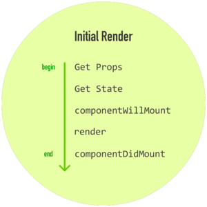
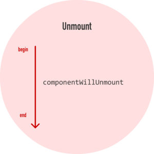

# REACTJS 16.2.0

---

* **Installation**

```html
<!-- Versions menu -->
https://unpkg.com/react/
https://unpkg.com/react-dom/

<!-- React dev -->
<script crossorigin 
src="https://unpkg.com/react@16.2.0/umd/react.development.js">
</script>
<script crossorigin
src="https://unpkg.com/react-dom@16.2.0/umd/react-dom.development.js">
</script>

<!-- React Router Dev-->
<script src="https://cdnjs.cloudflare.com/ajax/libs/react-router/
4.2.0/react-router.js"></script>
<script src="https://cdnjs.cloudflare.com/ajax/libs/react-router-dom/
4.2.2/react-router-dom.js"></script>

<!-- React Prod -->
<script crossorigin 
src="https://unpkg.com/react@16.2.0/umd/react.production.min.js">
</script>
<script crossorigin
src="https://unpkg.com/react-dom@16.2.0/umd/react-dom.production.min.js">
</script>

<!-- React Router Prod -->
<script src="https://cdnjs.cloudflare.com/ajax/libs/react-router/
4.2.0/react-router.min.js">
</script>
<script src="https://cdnjs.cloudflare.com/ajax/libs/react-router-dom/
4.2.2/react-router-dom.min.js"></script>

<!-- Babel -->
<script crossorigin
src="https://unpkg.com/babel-standalone@6.26.0/babel.min.js">
</script>
```

---

## JSX

JSX allows you to mix JavaScript and HTML-like tags to define user interface (UI) elements and their functionality  

### Create JSX Element

```javascript
// simple
const JSX = <h1>Hello JSX!</h1>;
// complex, all elements must be wrapped by a single parent element
const JSX = (
<div>
  <h1>Hello JSX!</h1>
  { /* this is a JSX comment */ }
  { 'this is treated as JavaScript code' }
	<p>Some info</p>
	<ul>
		<li>An item</li>
		<li>Another item</li>
		<li>A third item</li>
	</ul>
</div>);
```

### Render JSX Element

```javascript
// ReactDOM.render(componentToRender, targetNode)
ReactDOM.render(JSX, document.getElementById('challenge-node'));
```

### Syntax

* **Define an HTML Class in JSX** , use `className` instead of `class`  
The naming convention for all HTML attributes and event references in JSX become camelCase. For example, click event in JSX is onClick, instead of onclick.  
```javascript
const JSX = (
<div className = 'myDiv'>
	<h1>Add a class to this div</h1>
</div>);
```

* **Self-Closing JSX Tags** - Any JSX element can be written with a self-closing tag, and every element must be closed.  
-Line-break tag must always be written as `<br/>` in order to be valid JSX that can be transpiled.   
-`<div>` can be written as `<div/>` or `<div></div>`. Difference is that in the first syntax version there is no way to include anything in the `<div/>`  

## REACT COMPONENT

### Types

1.Using a Javascript function to create a stateless functional component  
```javascript
// After transpiled, <div> will have a CSS class of 'customClass'
const MyComponent = function() {
	return (
		<div className="customClass">
			Demo Solution
		</div>
	);
}
```

2. Using ES6 `class` syntax  
```javascript
class MyComponent extends React.Component {
  constructor(props) {
    super(props);
  }
  render() {
    return (
    	<h1>Hi</h1>
    );
  }
}
```

### Props (properties)

* **Pass a property**
```javascript
const CurrentDate = (props) => {
	return (
		<div>
			<p>The current date is: {props.date} </p>
		</div>
	);
};

class Calendar extends React.Component {
	constructor(props) {
		super(props);
	}
	render() {
		return (
			<div>
				<h3>What date is it?</h3>
				<CurrentDate date={Date()}/>
			</div>
		);
	}
};
```

* **Pass an Array as Props**
```javascript
<ParentComponent>
  <ChildComponent colors={["green", "blue", "red"]} />
</ParentComponent>

const ChildComponent = (props) => <p>{props.colors.join(', ')}</p>
```

```javascript
const List= (props) => {
	return <p>{props.tasks.join(", ")}</p>
};

class ToDo extends React.Component {
  constructor(props) {
  	super(props);
  }
  render() {
    return (
      <div>
        <h1>To Do Lists</h1>
				<h2>Today</h2>
        <List tasks={["today1", "today2"]}/>
				<h2>Tomorrow</h2>
        <List tasks={["tomorrow1", "tomorrow2", "tomorrow3"]}/>
      </div>
    );
  }
};
```

* **Use Default Props**  
-You can assign default props to a component as a property on the component itself and React assigns the default prop if necessary  
-React assigns default props if props are undefined, but if you pass null as the value for a prop, it will remain null  
-The way to override the default props is to explicitly set the prop values for a component.  
-Declare it just inmediately after component declaration  
```javascript
MyComponent.defaultProps = { location: 'San Francisco' }  
```

```javascript
const ShoppingCart = (props) => {
  return (
		<div>
			<h1>Shopping Cart Component</h1>
		</div>
  )
};
ShoppingCart.defaultProps = {
  items:0
}
```

```javascript
// Override Default props
const Items = (props) => {
	return (
    <h1>Current Quantity of Items in Cart: {props.quantity}</h1>
  )
}

Items.defaultProps = {
	quantity: 0
}

class ShoppingCart extends React.Component {
	constructor(props) {
		super(props);
	}
  render() {
    return <Items quantity={10} />
  }
};
```

* **PropTypes to Define the Props You Expect**  
-Set propTypes when you know the type of a prop ahead of time  
```javascript
// require the type function for a prop called handleClick
import React, { PropTypes } from 'react';
MyComponent.propTypes = { handleClick: PropTypes.func.isRequired }
```

```javascript
const Items = (props) => {
	return <h1>Current Quantity of Items in Cart: {props.quantity}</h1>
};

Items.propTypes =  {
	quantity: PropTypes.number.isRequired
}

Items.defaultProps = {
	quantity: 0
};

class ShoppingCart extends React.Component {
	constructor(props) {
		super(props);
	}
  render() {
    return <Items />
  }
};
```

* **Access Props Using this.props**  
-Pass a prop to an ES6 class component  
-Anytime you refer to a class component within itself, use `this` keyword.  
-To access props within a class component, preface the code that you use to access it with `this`.  
-For example, if an ES6 class component has a prop called data, you write {this.props.data} in JSX.
```javascript
class ReturnTempPassword extends React.Component {
  constructor(props) {
  	super(props);
  }
  render() {
    return (
      <div>
        <p>Your temporary password is: 
          <strong>{this.props.tempPassword}</strong>
        </p>
      </div>
    );
  }
};

class ResetPassword extends React.Component {
  constructor(props) {
  	super(props);
  }
  render() {
    return (
      <div>
        <h2>Reset Password</h2>
        <h3>We've generated a new temporary password for you.</h3>
        <h3>Please reset this password settings ASAP.</h3>
        <ReturnTempPassword tempPassword="serrPbqrPnzc" />
      </div>
    );
  }
};
```

* **More props with es6 class components**  
```javascript
class CampSite extends React.Component {
  constructor(props) {
    super(props);
  }
  render() {
    return (
      <div>
        <Camper/>
      </div>
    );
  }
};
// change code below this line

const Camper = (props) => {
   return (
     <div>
       <p>{props.name}</p>
     </div>
   );
};

Camper.propTypes = {
	name: PropTypes.string.isRequired
};

Camper.defaultProps = {
  name: 'CamperBot'
};

```

### Style CSS in React 

```javascript
/* global ReactDOM React */
const destination = document.getElementById('container');

class Letter extends React.Component {
  render() {
    const letterStyle = {
      padding: 10,
      margin: 10,
      backgroundColor: this.props.bgcolor,
      color: "#333",
      display: "inline-block",
      fontFamily: "monospace",
      fontSize: 32,
      textAlign: "center"
    };
    return (
      <div style={letterStyle}>
        {this.props.children}
      </div>
    );
  }
}

const layout = (
  <div>
    <Letter bgcolor="#58b3ff">A</Letter>
    <Letter bgcolor="#ff605f">E</Letter>
    <Letter bgcolor="#ffd52e">I</Letter>
    <Letter bgcolor="#49dd8e">O</Letter>
    <Letter bgcolor="#ae99ff">U</Letter>
  </div>
);

ReactDOM.render(
  layout,
  destination
);

```

### Composition

*You can render JSX elements, stateless functional components, and ES6 class components within other components*

* #### **Component composition**

```javascript
/* global ReactDOM React */
const destination = document.getElementById('container');

class Card extends React.Component {
  render() {
    const cardStyle = {
      height: 200,
      width: 150,
      padding: 0,
      backgroundColor: "#FFF",
      WebkitFilter: "drop-shadow(0px 0px 5px #666)",
      filter: "drop-shadow(0px 0px 5px #666)"
    };
    return (
      <div style={cardStyle}>
        <Square color={this.props.color} />
        <Label color={this.props.color} />
      </div>
    );
  }
}

class Square extends React.Component {
  render() {
    const squareStyle = {
      height: 150,
      backgroundColor: this.props.color
    };
    return (
      <div style={squareStyle}>

      </div>
    );
  }
}

class Label extends React.Component {
  render() {
    const labelStyle = {
      fontFamily: "sans-serif",
      fontWeight: "bold",
      padding: 13,
      margin: 0
    };
    return (
      <p style={labelStyle}>{this.props.color}</p>
    );
  }
}

const layout = (
  <div>
    <Card color="lightblue" />
  </div>
);

ReactDOM.render(
  layout,
  destination
);
```

* ####  **Transferring properties using spread operator**

```javascript
/* global ReactDOM React */
const destination = document.getElementById('container');

class Display extends React.Component {
  render() {
    return (
      <div>
        <p>{this.props.color}</p>
        <p>{this.props.num}</p>
        <p>{this.props.size}</p>
      </div>
    );
  }
}

class Label extends React.Component {
  render() {
    return (
      <Display {...this.props} />
    );
  }
}

class Shirt extends React.Component {
  render() {
    return (
      <div>
        <Label {...this.props} />
      </div>
    );
  }
}

const layout = (
  <div>
    <Shirt color="steelblue" num="3.14" size="medium" />
  </div>
);

ReactDOM.render(
  layout,
  destination
);
```

### State

* #### **State**

```javascript
/* global ReactDOM React */
const destination = document.getElementById('container');

class LightningCounter extends React.Component {
  constructor(props, context) {
    super(props, context);
    this.state = {
      strikes: 0
    };
    this.timerTick = this.timerTick.bind(this);
  }
  componentDidMount() {
    setInterval(this.timerTick, 1000);
  }
  timerTick() {
    this.setState({
      strikes: this.state.strikes + 100
    });
  }
  render() {
    const counterStyle = {
      color: "#66FFFF",
      fontSize: 50
    };
    const count = this.state.strikes.toLocaleString();
    return (
      <h1 style={counterStyle}>{count}</h1>
    );
  }
}

class LightningCounterDisplay extends React.Component {
  render() {
    const commonStyle = {
      margin: 0,
      padding: 0
    };

    const divStyle = {
      width: 250,
      textAlign: "center",
      backgroundColor: "#020202",
      padding: 40,
      fontFamily: "sans-serif",
      color: "#999999",
      borderRadius: 10
    };

    const textStyles = {
      emphasis: {
        fontSize: 38,
        ...commonStyle
      },
      smallEmphasis: {
        ...commonStyle
      },
      small: {
        fontSize: 17,
        opacity: 0.5,
        ...commonStyle
      }
    }

    return (
      <div style={divStyle}>
        <LightningCounter />
        <h2 style={textStyles.smallEmphasis}>LIGHTNING STRIKES</h2>
        <h2 style={textStyles.emphasis}>WORLDWIDE</h2>
        <p style={textStyles.small}>(since you loaded this example)</p>
      </div>
    );
  }
}

const layout = (
  <div>
    <LightningCounterDisplay />
  </div>
);

ReactDOM.render(
  layout,
  destination
);
```

* #### **From data to UI**

```javascript
/* global ReactDOM React */
const destination = document.getElementById('container');

class Circle extends React.Component {
  render() {
    const circleStyle = {
      padding: 10,
      margin: 20,
      display: "inline-block",
      backgroundColor: this.props.bgColor,
      borderRadius: "50%",
      width: 100,
      height: 100,
    };

    return (
      <div style={circleStyle}>
      </div>
    );
  }
}

const colors = ["#393E41", "#E94F37", "#1C89BF", "#A1D363",
  "#85FFC7", "#297373", "#FF8552", "#A40E4C"];

const renderData = [];

for (let i = 0; i < colors.length; i++) {
  const color = colors[i];
  renderData.push(<Circle key={i + color} bgColor={colors[i]} />);
}

const layout = (
  <div>
    {renderData}
  </div>
);

ReactDOM.render(
  layout,
  destination
);
```

* #### **forceUpdate()**

if setState doesnt rerender the component [use forceUpdate()](https://stackoverflow.com/questions/30626030/can-you-force-a-react-component-to-rerender-without-calling-setstate/35004739)

```sh
By default, when your components state or props change, your component
will re-render. However, if these change implicitly (eg: data deep within
an object changes without changing the object itself) or if your render() 
method depends on some other data, you can tell React that it needs to 
re-run render() by calling forceUpdate().
```


---

## DATA COMMUNICATION

[Basic Ideas](https://www.andrewhfarmer.com/component-communication/)

### Child to Parent  

[Complete Example](https://jolav.me/freecodecamp/old/data/markdown-previewer/markdown.html)

```js
class Container extends React.Component {
  constructor(props) {
    super(props);
    this.state = {
      input: props.template,
    };
    this.getBackData = this.getBackData.bind(this);
  }
  getBackData(data) {
    this.setState({ input: data });
  }
  render() {
    return (
      <div style={container}>
        <Editor placeholder={this.state.input}
          callback={this.getBackData)} />
        <Viewer raw={this.state.input} />
      </div>
    );
  }
}

class Editor extends React.Component {
  constructor(props) {
    super(props);
    this.editing = this.editing.bind(this);
  }
  editing(e) {
    e.preventDefault();
    this.props.callback(e.target.value);
  }
  render() {
    return (
      <div className="input">
        <textarea id="input" placeholder={this.props.placeholder}
          onChange={this.editing}>
        </textarea>
      </div>
    );
  }
}
```

---

## LIFECYCLE METHODS






```javascript
/* global ReactDOM React */
const destination = document.getElementById('container');

class Counter extends React.Component {
  render() {
    const textStyle = {
      fontSize: 72,
      fontFamily: "sans-serif",
      color: "#333",
      fontWeight: "bold"
    };

    return (
      <div style={textStyle}>
        {this.props.display}
      </div>
    );
  }
}

class CounterParent extends React.Component {
  constructor(props, context) {
    super(props, context);
    console.log("constructor: Default state time!");
    this.state = {
      count: 0
    };
    this.increase = this.increase.bind(this);
  }
  getInitialState() {
    console.log("getInitialState: Default state time!");
    return {
      count: 0
    };
  }
  increase() {
    this.setState({
      count: this.state.count + 1
    });
  }
  componentWillUpdate(newProps, newState) {
    console.log("componentWillUpdate: Component is about to update!");
  }
  componentDidUpdate(currentProps, currentState) {
    console.log("componentDidUpdate: Component just updated!");
  }
  componentWillMount() {
    console.log("componentWillMount: Component is about to mount!");
  }
  componentDidMount() {
    console.log("componentDidMount: Component just mounted!");
  }
  componentWillUnmount() {
    console.log("componentWillUnmount: Component is about to be removed
    from the DOM!");
  }
  shouldComponentUpdate(newProps, newState) {
    console.log("shouldComponentUpdate: Should component update?");
    if (newState.count < 5) {
      console.log("shouldComponentUpdate: Component should update!");
      return true;
    } else {
      ReactDOM.unmountComponentAtNode(destination);
      console.log("shouldComponentUpdate: Component should not update!");
      return false;
    }
  }
  componentWillReceiveProps(newProps) {
    console.log("componentWillReceiveProps: Component will get new 
    props!");
  }
  render() {
    const backgroundStyle = {
      padding: 50,
      border: "#333 2px dotted",
      width: 250,
      height: 100,
      borderRadius: 10,
      textAlign: "center"
    };
    return (
      <div style={backgroundStyle}>
        <Counter display={this.state.count} />
        <button onClick={this.increase}>
          +
        </button>
      </div>
    );
  }
}

console.log("defaultProps: Default prop time!");
CounterParent.defaultProps = {
};

const layout = (
  <div>
    <CounterParent />
  </div>
);

ReactDOM.render(
  layout,
  destination
);
```

---

## CONDITIONAL RENDERING

### Variables

```js
render() {
  const isLoggedIn = this.state.isLoggedIn;

  let button = null;
  if (isLoggedIn) {
    button = <LogoutButton onClick={this.handleLogoutClick} />;
  } else {
    button = <LoginButton onClick={this.handleLoginClick} />;
  }

  return (
    <div>
      <Greeting isLoggedIn={isLoggedIn} />
      {button}
    </div>
  );
}
```

### If

```js
return (
  <div>
    <h1>Hello!</h1>
    {unreadMessages.length > 0 &&
      <h2>
        You have {unreadMessages.length} unread messages.
      </h2>
    }
  </div>
);
```

### If-else

`codition ? true : false` - 

```js
return (
  <div>
    The user is <b>{isLoggedIn ? 'currently' : 'not'}</b> logged in.
  </div>
);
```

```js
return (
  <div>
    {isLoggedIn ? (
      <LogoutButton onClick={this.handleLogoutClick} />
    ) : (
      <LoginButton onClick={this.handleLoginClick} />
    )}
  </div>
);
```


---

## EVENTS

Events in React are `SyntheticEvent` that wraps normal events  
[React Event System Document](https://reactjs.org/docs/events.html)  

* **`this` inside the event handler**  
-In non-React, value of this inside an event handler refers to the element that fired the event.  
-In React, value of this inside your event handler always refers to the component the event handler lives in:

* #### **Listening DOM Events**
```javascript
class Something extends React.Component {
  handleMyEvent(e) {
    // do something
  }
  componentDidMount() {
    window.addEventListener("someEvent", this.handleMyEvent);
  }
  componentWillUnmount() {
    window.removeEventListener("someEvent", this.handleMyEvent);
  }
  render() {
    return (
      <div myWeirdEvent={this.handleMyEvent}>Hello!</div>
    );
  }
};
```

* #### **Synthetic Events**
```javascript
/* global ReactDOM React */
const destination = document.getElementById('container');

class Counter extends React.Component {
  render() {
    const textStyle = {
      fontSize: 72,
      fontFamily: "sans-serif",
      color: "#333",
      fontWeight: "bold"
    };
    return (
      <div style={textStyle}>
        {this.props.display}
      </div>
    );
  }
}

class CounterParent extends React.Component {
  constructor(props) {
    super(props);
    this.state = {
      count: 0
    };
    this.increase = this.increase.bind(this);
  }
  increase(e) {
    //console.log(e);
    let currentCount = this.state.count;
    if (e.shiftKey) {
      currentCount += 10;
    } else {
      currentCount += 1;
    }
    this.setState({
      count: currentCount
    });
  }
  render() {
    const backgroundStyle = {
      padding: 50,
      backgroundColor: "#FFC53A",
      width: 250,
      height: 100,
      borderRadius: 10,
      textAlign: "center"
    };
    const buttonStyle = {
      fontSize: "1em",
      width: 30,
      height: 30,
      fontFamily: "sans-serif",
      color: "#333",
      fontWeight: "bold",
      lineHeight: "3px"
    };
    return (
      <div style={backgroundStyle}>
        <Counter display={this.state.count} />
        <button onClick={this.increase} style={buttonStyle}>+</button>
      </div>
    );
  }
}

const layout = (
  <div>
    <CounterParent />
  </div>
);

ReactDOM.render(
  layout,
  destination
);
```

* #### **Pass Parameter from events**
```js
onClick={() => this.functionName(params)}
```

---

## PORTALS

### Usage

```js
// These two containers are siblings in the DOM
const appRoot = document.getElementById('app-root');
const modalRoot = document.getElementById('modal-root');

// Let's create a Modal component that is an abstraction around
// the portal API.
class Modal extends React.Component {
  constructor(props) {
    super(props);
    // Create a div that we'll render the modal into. Because each
    // Modal component has its own element, we can render multiple
    // modal components into the modal container.
    this.el = document.createElement('div');
  }

  componentDidMount() {
    // Append the element into the DOM on mount. We'll render
    // into the modal container element (see the HTML tab).
    modalRoot.appendChild(this.el);
  }

  componentWillUnmount() {
    // Remove the element from the DOM when we unmount
    modalRoot.removeChild(this.el);
  }

  render() {
    // Use a portal to render the children into the element
    return ReactDOM.createPortal(
      // Any valid React child: JSX, strings, arrays, etc.
      this.props.children,
      // A DOM element
      this.el,
    );
  }
}

// The Modal component is a normal React component, so we can
// render it wherever we like without needing to know that it's
// implemented with portals.
class App extends React.Component {
  constructor(props) {
    super(props);
    this.state = { showModal: false };

    this.handleShow = this.handleShow.bind(this);
    this.handleHide = this.handleHide.bind(this);
  }

  handleShow() {
    this.setState({ showModal: true });
  }

  handleHide() {
    this.setState({ showModal: false });
  }

  render() {
    // Show a Modal on click.
    // (In a real app, don't forget to use ARIA attributes
    // for accessibility!)
    const modal = this.state.showModal ? (
      <Modal>
        <div className="modal">
          <div>
            With a portal, we can render content into a different
            part of the DOM, as if it were any other React child.
          </div>
          This is being rendered inside the #modal-container div.
          <button onClick={this.handleHide}>Hide modal</button>
        </div>
      </Modal>
    ) : null;

    return (
      <div className="app">
        This div has overflow: hidden.
        <button onClick={this.handleShow}>Show modal</button>
        {modal}
      </div>
    );
  }
}

ReactDOM.render(<App />, appRoot);
```

### Event Bubbling

```js
// These two containers are siblings in the DOM
const appRoot = document.getElementById('app-root');
const modalRoot = document.getElementById('modal-root');

class Modal extends React.Component {
  constructor(props) {
    super(props);
    this.el = document.createElement('div');
  }

  componentDidMount() {
    modalRoot.appendChild(this.el);
  }

  componentWillUnmount() {
    modalRoot.removeChild(this.el);
  }
  
  render() {
    return ReactDOM.createPortal(
      this.props.children,
      this.el,
    );
  }
}

class Parent extends React.Component {
  constructor(props) {
    super(props);
    this.state = {clicks: 0};
    this.handleClick = this.handleClick.bind(this);
  }

  handleClick() {
    // This will fire when the button in Child is clicked,
    // updating Parent's state, even though button
    // is not direct descendant in the DOM. 
    this.setState(prevState => ({
      clicks: prevState.clicks + 1
    }));
  }

  render() {
    return (
      <div onClick={this.handleClick}>
        <p>Number of clicks: {this.state.clicks}</p>
        <p>
          Open up the browser DevTools
          to observe that the button
          is not a child of the div
          with the onClick handler.
        </p>
        <Modal>
          <Child />
        </Modal>
      </div>
    );
  }
}

function Child() {
  // The click event on this button will bubble up to parent,
  // because there is no 'onClick' attribute defined
  return (
    <div className="modal">
      <button>Click</button>
    </div>
  );
}

ReactDOM.render(<Parent />, appRoot);
```

---

## REACT ROUTER 4.2.0

### Basic

```js
/* global ReactDOM React */

const destination = document.getElementById('book');
const Router = window.ReactRouterDOM.BrowserRouter;
const Route = window.ReactRouterDOM.Route;
const Link = window.ReactRouterDOM.Link;
const Prompt = window.ReactRouterDOM.Prompt;
const Switch = window.ReactRouterDOM.Switch;
const Redirect = window.ReactRouterDOM.Redirect;

const development = "/old/apps/book/html";
const production = "/old/apps/book";

class Controller extends React.Component {
  constructor(props) {
    super(props);
    this.state = {
      data: {
      },
      default: development// production
    };
  }
  render() {
    const a = {
      textAlign: "center",
      fontFamily: "Indie Flower"
    };
    return (
      <div className="plugin" style={a}>
        <h1>Book Trading Club</h1>
        <Router>
          <div>
            <ul>
              <li>
                <Link to='./book.html'>Index</Link>
              </li>
              <li>
                <Link to='./home'>Home</Link>
              </li>
              <li>
                <Link to='./about'>About</Link>
              </li>
            </ul>
            <Switch>
              <Route exact path={this.state.default + "/book.html"} 
              component={Index} />
              <Route path={this.state.default + "/home"} 
              component={Home} />
              <Route path={this.state.default + "/about"} 
              component={About} />
            </Switch>
          </div>
        </Router>
      </div>
    );
  }
}

const Index = () => (
  <div>
    <h1>Index</h1>
  </div>
);

const Home = () => (
  <div>
    <h1>Welcome home</h1>
  </div>
);

const About = () => (
  <div>
    <h1>About</h1>
  </div>
);

const layout = (
  <Controller />
);

ReactDOM.render(
  layout,
  destination
);
```

### Example

```js
/* global ReactDOM React lib Home About Index LoginForm SignUpForm
 ShowBooks MyBooks UserDataForm*/

const Router = window.ReactRouterDOM.BrowserRouter;
const Route = window.ReactRouterDOM.Route;
const Link = window.ReactRouterDOM.Link;
const Prompt = window.ReactRouterDOM.Prompt;
const Switch = window.ReactRouterDOM.Switch;
const Redirect = window.ReactRouterDOM.Redirect;

class Controller extends React.Component {
  render() {
    const a = {
      textAlign: "center",
    };
    const gap = {
      paddingTop: "75px",
    };
    const links = {
      fontFamily: "arial",
      fontSize: "1em",
    };
    return (
      <div className="plugin" style={a}>
        <Menu
          showLogin={this.showLogin}
          showSignup={this.showSignup}
          goAllBooks={this.goAllBooks}
          goMyBooks={this.goMyBooks}
          goUserData={this.goUserData}
          doLogout={this.doLogout}
          isLogged={this.state.isLogged}
          user={this.state.user}
        />
        <div style={gap}>
          <div style={links}>
            {/*<Link to='./book.html'> <h1>Index</h1> </Link>
            <Link to='./login'> Login </Link>
            <Link to='./signup'> Signup </Link>
            <Link to='./allbooks'> AllBooks </Link>
            <Link to='./mybooks'> MyBooks </Link>
            <Link to='./userdata'> UserData </Link>
            <Link to='./'>  </Link>*/}
          </div>
          <Switch>
            <Route exact path={this.state.default + "/book.html"}
              component={Home} />
            <Route path={this.state.default + "/login"}
              render={() => (
                <LoginForm doLogin={this.doLogin} />
              )} />
            <Route path={this.state.default + "/signup"}
              render={() => (
                <SignUpForm doSignup={this.doSignup} />
              )} />
            <Route path={this.state.default + "/allbooks"}
              render={() => (
                <ShowBooks
                  books={this.state.books}
                  username={this.state.profile.username}
                  askTrade={this.askTrade}
                />
              )} />
            <Route path={this.state.default + "/mybooks"}
              render={() => (
                <MyBooks books={this.state.books}
                  username={this.state.profile.username}
                  addBook={this.addBook}
                  acceptTrade={this.acceptTrade}
                />
              )} />
            <Route path={this.state.default + "/userdata"}
              render={() => (
                <UserDataForm
                  profile={this.state.profile}
                  updateProfile={this.updateProfile}
                />
              )} />
            {/*<Route path={this.state.default + "/"}
              component={} />*/}
          </Switch>
        </div>
        <Footer
          isEmpty={this.props.location.pathname === prod + "/allbooks"
            || this.props.location.pathname === prod + "/mybooks"} />
      </div >
    );
  }
}

const layout = (
  <Router>
    <Route path="/" component={Controller} />
  </Router>
);

ReactDOM.render(
  layout,
  destination
);
```