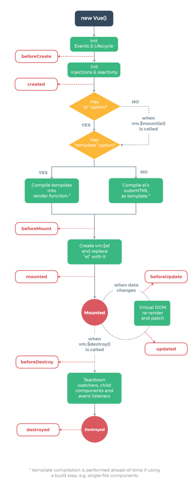

# VUEJS 2.5.16

---

## INTRO

*  **Installation**

```html
<!-- LAst Vuejs version -->
<script src="https://unpkg.com/vue"></script>
<script stc="https://cdn.jsdelivr.net/npm/vue"></script>

<!-- Choose Version -->
<script stc="https://cdn.jsdelivr.net/npm/vue/"></script>
<script stc="https://cdn.jsdelivr.net/npm/vue@x.x.x"></script>
```

---

## VUE INSTANCE  

Every Vue application starts by creating a new Vue instance  

```javascript
const vm = new Vue({ // vm shor for ViewModel
  // options object we pass to crate a Vue instance
})
```

Vue instances expose a number of useful instance properties and methods. These are prefixed with $ to differentiate them from user-defined properties  

```javascript
const data = { a: 1 }
const vm = new Vue({
  el: '#example',
  data: data
})
vm.$data === data // => true
vm.$el === document.getElementById('example') // => true
// $watch is an instance method
vm.$watch('a', function (newValue, oldValue) {
  // This callback will be called when `vm.a` changes
})
```

### Properties  

**`vm.$data`** -  When a Vue instance is created, it adds all the properties found in its data object to Vue’s reactivity system. When the values of those properties change, the view will “react”, updating to match the new values.  

```javascript
// Our data object
const data = { a: 1 }
// The object is added to a Vue instance
const vm = new Vue({
  data: data
})
// These reference the same object!
vm.a === data.a // => true
// Setting the property on the instance
// also affects the original data
vm.a = 2
data.a // => 2
// ... and vice-versa
data.a = 3
vm.a // => 3
```

Properties in data are only reactive if they existed when the instance was created  

**`vm.$props`** - 

**`vm.$el`** - 

**`vm.$options`** - 

**`vm.$parent`** - 

**`vm.$root`** - 

**`vm.$children`** - 

**`vm.$slots`** - 

**`vm.$scopedSlots`** - 

**`vm.$refs`** -  

**`vm.$isServer`** - 

**`vm.$attrs`** - 

**`vm.$listeners`** -  

### Computed properties

Use for any complex logic  

```html
// NOT
<div id="example">
  {{ message.split('').reverse().join('') }}
</div>

// YES
<div id="example">
  <p>Original message: "{{ message }}"</p>
  <p>Computed reversed message: "{{ reversedMessage }}"</p>
</div>
<script>
  const vm = new Vue({
    el: '#example',
    data: {
      message: 'Hello'
    },
    computed: {
      reversedMessage: function () {
        // `this` points to the vm instance
        return this.message.split('').reverse().join('')
      }
    }
  })
</script>
```

* **vs Methods**  

-Computed properties are cached based on their dependencies, as long as message has not changed will return the previously computed result without having to run the function again. Uses for expensive calculations.

-A method invocation will always run the function whenever a re-render happens.

* **vs watched property**  

-Generic way to observe and react to data changes on a Vue instance, it is often a better idea to use a computed property  

```html
<div id="demo">{{ fullName }}</div>
```

```javascript
// watch
const vm = new Vue({
  el: '#demo',
  data: {
    firstName: 'Foo',
    lastName: 'Bar',
    fullName: 'Foo Bar'
  },
  watch: {
    firstName: function (val) {
      this.fullName = val + ' ' + this.lastName
    },
    lastName: function (val) {
      this.fullName = this.firstName + ' ' + val
    }
  }
})
```

```javascript
// computed property
const vm = new Vue({
  el: '#demo',
  data: {
    firstName: 'Foo',
    lastName: 'Bar'
  },
  computed: {
    fullName: function () {
      return this.firstName + ' ' + this.lastName
    }
  }
})
```

* **computed setter** - Computed properties are by default getter-only, but you can also provide a setter. 

```javascript
computed: {
  fullName: {
    // getter
    get: function () {
      return this.firstName + ' ' + this.lastName
    },
    // setter
    set: function (newValue) {
      const names = newValue.split(' ')
      this.firstName = names[0]
      this.lastName = names[names.length - 1]
    }
  }
}
// Now when you run vm.fullName = 'John Doe', the setter will be 
// invoked and vm.firstName and vm.lastName will be updated 
```

### Methods

```javascript
// in component
methods: {
  method: function () {
    return foo
  }
}
```

* #### **Data**  

**`vm.$watch(expOrFn, callback, [options])`** - Watch an expression or a computed function on the Vue instance for changes. The callback gets called with the new value and the old value. The expression only accepts dot-delimited paths. For more complex expressions, use a function instead.  

```javascript
// keypath
vm.$watch('a.b.c', function (newVal, oldVal) {
  // do something
})
// function
vm.$watch(
  function () {
    return this.a + this.b
  },
  function (newVal, oldVal) {
    // do something
  }
)
```

**`vm.$set`** - 

**`vm.$delete`** - 

* #### **Events**    

**`vm.$on`** - Listen for a custom event on the current vm.

```javascript
vm.$on('test', function (msg) {
  console.log(msg)
})
vm.$emit('test', 'hi')
// => "hi"
```

**`vm.$once(event, callback)`** - Listen for a custom event only once, will be removed once it triggers for the first time.  

**`vm.$off([event, callback])`** -   
-If no arguments are provided, remove all event listeners;  
-If only the event is provided, remove all listeners for that event;  
-If both event and callback are given, remove the listener for that specific   callback only.
 
**`vm.$emit(event, [...args])`** - Trigger an event on the current instance, args will be passed into the listeners callback function   

* #### **LifeCycle**

**`vm.$mount`** - 

**`vm.$forceUpdate`** - 

**`vm.$nextTick`** - 

**`vm.$destroy`** - 


### Lifecycle hooks  

All lifecycle hooks automatically have their this context bound to the instance, so that you can access data, computed properties, and methods.  
Dont use an arrow function to define a lifecycle method (created: () => this.fetchTodos()). Arrow functions bind the parent context, so this will not be the Vue instance as you expect and this.fetchTodos will be undefined.


**`beforeCreate`**-  

**`created`** -  

**`beforeMount`** -  

**`mounted`** -  

**`beforeUpdate`** -  

**`updated`** -  

**`beforeDestroy`** -  

**`destroyed`** -  

**`activated`** -  

**`deactivated`** -  

**`errorCaptured`** -  


  

---

## DIRECTIVES

Special attributes that apply special reactive behavior to the rendered DOM.  
Directive attribute values are expected to be a single JavaScript expression  

-arguments: colon after directive name  

```javascript
<a v-on:click="doSomething">Click me</a>
```

-modifiers: special postfixes denoted by a dot, which indicate that a directive should be bound in some special way.

```javascript
// .prevent -> call event.preventDefault()
<form v-on:submit.prevent="onSubmit">Click me</form>
```

### Standard

* **`v-bind`, `shorthand: :`** - bind attributes or a component prop to an expression.  
```html
<!-- bind an attribute -->

<!-- shorthand -->

<!-- with inline string concatenation -->

<!-- class binding -->
<div :class="{ red: isRed }"></div>
<div :class="[classA, classB]"></div>
<div :class="[classA, { classB: isB, classC: isC }]">
<!-- style binding -->
<div :style="{ fontSize: size + 'px' }"></div>
<div :style="[styleObjectA, styleObjectB]"></div>
<!-- binding an object of attributes -->
<div v-bind="{ id: someProp, 'other-attr': otherProp }"></div>
```

```html
<div id="app-2">
  <span v-bind:title="message">
    Hover mouse over me to see my title!
  </span>
</div>

<script>
  const app2 = new Vue({
    el: '#app-2',
    data: {
      message: 'Loaded page on ' + new Date().toLocaleString()
    }
  })
</script>
```

* **`v-if`, `v-else`, `v-else-if`** - Conditionally render the element based on the truthy-ness of the expression value.  
Prefer v-if if the condition is unlikely to change at runtime.

```html
<div v-if="type === 'A'">
  A
</div>
<div v-else-if="type === 'B'">
  B
</div>
<div v-else-if="type === 'C'">
  C
</div>
<div v-else>
  Not A/B/C
</div>
```  

```html
<div id="app-3">
  <span v-if="seen">Now you see me</span>
</div>

<script>
  const app3 = new Vue({
    el: '#app-3',
    data: {
      seen: true
    }
  })
</script>
```

Reusable elements with `key`. Elements with key will be rendered from scratch  

```html
<template v-if="loginType === 'username'">
  <label>Username</label>
  <input placeholder="Enter your username">
</template>
<template v-else>
  <label>Email</label>
  <input placeholder="Enter your email address">
</template>

<template v-if="loginType === 'username'">
  <label>Username</label>
  <input placeholder="Enter your username" key="username-input">
</template>
<template v-else>
  <label>Email</label>
  <input placeholder="Enter your email address" key="email-input">
</template>

```

* **`v-show`** - Same as v-if, the difference is that an element with v-show will always be rendered and remain in the DOM  
Prefer v-show if you need to toggle something very often

```html
<h1 v-show="ok">Hello!</h1>
```

* **`v-for`** -  
```javascript
// directive’s value must use the special syntax alias in expression
<div v-for="item in items">
  {{ item.text }}
</div>
// alias for the index (or the key if used on an Object)
<div v-for="(item, index) in items"></div>
<div v-for="(val, key) in object"></div>
<div v-for="(val, key, index) in object"></div>
```

```html
<div id="app-4">
  <ul>
    <li v-for="(val,key,index) in todos">
      {{ key }} ==> {{val.text}}==> {{index}}
    </li>
  </ul>
</div>

<script>
  const app4 = new Vue({
    el: '#app-4',
    data: {
      todos: [
        { text: 'Learn JavaScript' },
        { text: 'Learn Vue' },
        { text: 'Build something awesome' }
      ]
    }
  })
</script>
```

```html
<ul id="v-for-object" class="demo">
  <li v-for="value in object">
    {{ value }}
  </li>
</ul>

<script>
  new Vue({
    el: '#v-for-object',
    data: {
      object: {
        firstName: 'John',
        lastName: 'Doe',
        age: 30
      }
    }
  })
</script>

<!-- result
John
Doe
30
 -->
```

It is recommended to provide a key with v-for whenever possible, unless the iterated DOM content is simple

```html
<div v-for="item in items" :key="item.id">
  <!-- content -->
</div>
```

* **`v-on`, `shorthand: @`** - attach event listeners. When used on a normal element, it listens to native DOM events only. When used on a custom element component, it also listens to custom events emitted on that child component.  

```javascript
// Modifiers:
.stop - call event.stopPropagation().
.prevent - call event.preventDefault().
.capture - add event listener in capture mode.
.self - only trigger handler if event was dispatched from this element.
.{keyCode | keyAlias} - only trigger handler on certain keys.
.native - listen for a native event on the root element of component.
.once - trigger handler at most once.
.left - only trigger handler for left button mouse events.
.right - only trigger handler for right button mouse events.
.middle - only trigger handler for middle button mouse events.
.passive - attaches a DOM event with { passive: true }.

// examples
<!-- method handler -->
<button v-on:click="doThis"></button>
<!-- object syntax (2.4.0+) -->
<button v-on="{ mousedown: doThis, mouseup: doThat }"></button>
<!-- inline statement -->
<button v-on:click="doThat('hello', $event)"></button>
<!-- shorthand -->
<button @click="doThis"></button>
<!-- stop propagation -->
<button @click.stop="doThis"></button>
<!-- prevent default -->
<button @click.prevent="doThis"></button>  
<!-- prevent default without expression -->  
<form @submit.prevent></form>  
<!-- chain modifiers -->  
<button @click.stop.prevent="doThis"></button>  
<!-- key modifier using keyAlias -->  
<input @keyup.enter="onEnter">  
<!-- key modifier using keyCode -->  
<input @keyup.13="onEnter">  
<!-- the click event will be triggered at most once -->  
<button v-on:click.once="doThis"></button>  
```

```html
<div id="app-5">
  <p>{{ message }}</p>
  <button v-on:click="reverseMessage">Reverse Message</button>
</div>

<script>
  const app5 = new Vue({
    el: '#app-5',
    data: {
      message: 'Hello Vue.js!'
    },
    methods: {
      reverseMessage: function () {
        this.message = this.message.split('').reverse().join('')
      }
    }
  })
</script>
```

* **`v-model`** - Create a two-way binding on a form input element or a component.  

```javascript
// Limited to:
<input><select><textarea> and components

// modifiers
.lazy - listen to change events instead of input
.number - cast input string to numbers
.trim - trim input
```

```html
<div id="app-6">
  <p>{{ message }}</p>
  <input v-model="message">
</div>

<script>
  const app6 = new Vue({
    el: '#app-6',
    data: {
      message: 'Hello Vue!'
    }
  })
</script>
```

* **`v-text`** -  

* **`v-html`** - The contents are inserted as plain HTML - they will not be compiled as Vue templates. Can easily lead to XSS attacks. Only use v-html on trusted content and never on user-provided content.  

```javascript
<div v-html="html"></div>
```

* **`v-pre`** -  

* **`v-cloak`** -  

* **`v-once`** - Render the element and component once only. On subsequent re-renders, the element/component and all its children will be treated as static content and skipped. This can be used to optimize update performance.  

```javascript
<!-- single element -->
<span v-once>This will never change: {{msg}}</span>
<!-- the element have children -->
<div v-once>
  <h1>comment</h1>
  <p>{{msg}}</p>
</div>
<!-- component -->
<my-component v-once :comment="msg"></my-component>
<!-- v-for directive -->
<ul>
  <li v-for="i in list" v-once>{{i}}</li>
</ul>
```

### Custom

```html
<div id="app">
  <input v-model="item" v-focus type="text">
  <div v-square="item"></div>
</div>

<script>
  Vue.directive('focus', {
    inserted: function (el) {
      el.focus()
    }
  })

  Vue.directive('square', {
    bind: function (el, binding) {
      el.innerHTML = Math.pow(binding.value, 2);
    },
    update: function (el, binding) {
      el.innerHTML = Math.pow(binding.value, 2);
    }
  });

  new Vue({
    el: '#app',
    data: { item: 42 }
  });
</script>
```

---

## CLASS AND STYLE

### classes 

We can pass an object, array, expression or value to `v-bind:class` to dynamically toggle classes  

```html
<div class="static"
     v-bind:class="{ active: isActive, 'text-danger': hasError }">
</div>
<script>
  data: {
    isActive: true,
    hasError: false
  }
</script>
<!-- result -->
<div class="static active"></div>
```

When isActive or hasError changes, the class list will be updated accordingly.  


```html
<!-- Array Syntax -->
<div v-bind:class="[activeClass, errorClass]"></div>
<script>
  data: {
    activeClass: 'active',
    errorClass: 'text-danger'
  }
</script>
<!-- result -->
<div class="active text-danger"></div>
```

**with components**

When you use the class attribute on a custom component, those classes will be added to the component’s root element. Existing classes on this element will not be overwritten.  

### style

```html
<div v-bind:style="{ color: activeColor, fontSize: fontSize + 'px' }">
</div>
<script>
  data: {
    activeColor: 'red',
    fontSize: 30
  }
</script>
```

Best practice bind to a style object directly so that the template is cleaner:

```html
<div v-bind:style="styleObject"></div>
<script>
  data: {
    styleObject: {
      color: 'red',
      fontSize: '13px'
    }
  }
</script>
```

The array syntax for v-bind:style allows to apply multiple style objects to the same element:

```html
<div v-bind:style="[baseStyles, overridingStyles]"></div>
```

You can provide an array of multiple (prefixed) values to a style property. 
This will only render the last value in the array which the browser supports. 

```html
<div v-bind:style="{ display: ['-webkit-box', '-ms-flexbox', 'flex'] }">
</div>
```

---

## CHANGE DETECTION

Vue wraps observed *array’s mutation methods* (mutate the original array they are called on) so they will also trigger view updates  

- push()
- pop()
- shift()
- unshift()
- splice()
- sort()
- reverse()

*non-mutatind arrays* always return a new array so we can replace the old array with the new one. 

- filter()
- concat()
- slice()

**Array limitations** 

Vue cannot detect the following changes to an array:

- When you directly set an item with the index `vm.items[indexOfItem] = newValue`    

```javascript
// Vue.set
Vue.set(example1.items, indexOfItem, newValue)

// Array.prototype.splice
example1.items.splice(indexOfItem, 1, newValue)
```

- When you modify the length of the array `vm.items.length = newLength`

```javascript
// Use splice
example1.items.splice(newLength)
```

**Object Limitations**
 
Vue cannot detect property addition or deletion.

```javascript
const vm = new Vue({
  data: {
    a: 1
  }
})
// `vm.a` is now reactive
vm.b = 2
// `vm.b` is NOT reactive
```

`Vue.set(object, key, value)` workaround

```javascript
const vm = new Vue({
  data: {
    userProfile: {
      name: 'Anika'
    }
  }
})
```

`add a new property to the nested object ` workaround

```javascript
Vue.set(vm.userProfile, 'age', 27)
```

`vm.$set instance method (alias for the global Vue.set)` workaround

```javascript
this.$set(this.userProfile, 'age', 27)
```

`assign a number of new properties to an existing object using Object.assign() or _.extend()` workaround

```javascript
Object.assign(this.userProfile, {
  age: 27,
  favoriteColor: 'Vue Green'
})

this.userProfile = Object.assign({}, this.userProfile, {
  age: 27,
  favoriteColor: 'Vue Green'
})
```

---

## EVENT

### Event handling

`v-on` directive to listen to DOM events and run some JavaScript when they’re triggered.  

```html
<div id="example-1">
  <button v-on:click="counter += 1">Add 1</button>
  <p>The button above has been clicked {{ counter }} times.</p>
</div>

<script>
  const example1 = new Vue({
    el: '#example-1',
    data: {
      counter: 0
    }
  })
</script>
```

`v-on` can also accept the name of a method you’d like to call.

```html
<div id="example-2">
  <!-- `greet` is the name of a method defined below -->
  <button v-on:click="greet">Greet</button>
</div>

<script>
  const example2 = new Vue({
    el: '#example-2',
    data: {
      name: 'Vue.js'
    },
    // define methods under the `methods` object
    methods: {
      greet: function (event) {
        // `this` inside methods points to the Vue instance
        alert('Hello ' + this.name + '!')
        // `event` is the native DOM event
        if (event) {
          alert(event.target.tagName)
        }
      }
    }
  })
</script>
```

`methods in inline handlers` - Instead of binding directly to a method name, we can also use methods in an inline JavaScript statement  

```html
<div id="example-3">
  <button v-on:click="say('hi')">Say hi</button>
  <button v-on:click="say('what')">Say what</button>
</div>

<script>
  new Vue({
    el: '#example-3',
    methods: {
      say: function (message) {
        alert(message)
      }
    }
  })
</script>
```

To access the original DOM event in an inline statement handler you can pass it into a method using the special $event variable:

```html
<button v-on:click="warn('Form cannot be submitted yet.', $event)">
  Submit
</button>

<script>
  methods: {
    warn: function (message, event) {
      // now we have access to the native event
      if (event) event.preventDefault()
      alert(message)
    }
  }
</script>
```

### Event Modifiers

-.stop  
-.prevent  
-.capture  
-.self  
-.once  


```html
<!-- the click event's propagation will be stopped -->
<a v-on:click.stop="doThis"></a>
<!-- the submit event will no longer reload the page -->
<form v-on:submit.prevent="onSubmit"></form>
<!-- modifiers can be chained -->
<a v-on:click.stop.prevent="doThat"></a>
<!-- just the modifier -->
<form v-on:submit.prevent></form>
<!-- use capture mode when adding the event listener -->
<!-- i.e. an event targeting an inner element is handled here before
being handled by that element -->
<div v-on:click.capture="doThis">...</div>
<!-- only trigger handler if event.target is the element itself -->
<!-- i.e. not from a child element -->
<div v-on:click.self="doThat">...</div>
```

### Keyboard

```html
<!-- only call vm.submit() when the keyCode is 13 -->
<input v-on:keyup.13="submit">
<!-- same as above using ALIASES-->
<input v-on:keyup.enter="submit">
<!-- also works for shorthand -->
<input @keyup.enter="submit">
```

**aliases list**

-.enter  
-.tab  
-.delete (both “Delete” and “Backspace” keys)  
-.esc  
-.space  
-.up  
-.down  
-.left  
-.right  

You can define custom key modifiers aliases

```javascript
// enable v-on:keyup.f1
Vue.config.keyCodes.f1 = 112
```

**System Modifiers keys**

-.ctrl  
-.alt  
-.shift  
-.meta  

```html
<!-- Alt + C -->
<input @keyup.alt.67="clear">
<!-- Ctrl + Click -->
<div @click.ctrl="doSomething">Do something</div>
```

**mouse button**

-.left  
-.right  
-.middle  

---

## FORM INPUT

### Basic

`text` -  

```html
<input v-model="message" placeholder="edit me">
<p>Message is: {{ message }}</p>
```

`multiline text` -  

```html
<span>Multiline message is:</span>
<p style="white-space: pre-line;">{{ message }}</p>
<br>
<textarea v-model="message" placeholder="add multiple lines">
</textarea>
```

`checkbox` -  

```html
<div id='example-3'>
  <input type="checkbox" id="jack" value="Jack" v-model="checkedNames">
  <label for="jack">Jack</label>
  <input type="checkbox" id="john" value="John" v-model="checkedNames">
  <label for="john">John</label>
  <input type="checkbox" id="mike" value="Mike" v-model="checkedNames">
  <label for="mike">Mike</label>
  <br>
  <span>Checked names: {{ checkedNames }}</span>
</div>

<script>
  new Vue({
    el: '#example-3',
    data: {
      checkedNames: []
    }
  })
</script>
```

`radio` -  

```html
<input type="radio" id="one" value="One" v-model="picked">
<label for="one">One</label>
<br>
<input type="radio" id="two" value="Two" v-model="picked">
<label for="two">Two</label>
<br>
<span>Picked: {{ picked }}</span>
```

`select` -  

```html
<!-- Single select -->
<select v-model="selected">
  <option disabled value="">Please select one</option>
  <option>A</option>
  <option>B</option>
  <option>C</option>
</select>
<span>Selected: {{ selected }}</span>

<script>
  new Vue({
    el: '...',
    data: {
      selected: ''
    }
  })
</script>
```

```html
<!-- Multiple select (bound to array) -->
<select v-model="selected" multiple>
  <option>A</option>
  <option>B</option>
  <option>C</option>
</select>
<br>
<span>Selected: {{ selected }}</span>

<script>

</script>
```

```html
<!-- Dynamic options rendered with v-for -->
<select v-model="selected">
  <option v-for="option in options" v-bind:value="option.value">
    {{ option.text }}
  </option>
</select>
<span>Selected: {{ selected }}</span>

<script>
  new Vue({
    el: '...',
    data: {
      selected: 'A',
      options: [
        { text: 'One', value: 'A' },
        { text: 'Two', value: 'B' },
        { text: 'Three', value: 'C' }
      ]
    }
  })
</script>
```

### Value Bindings  

For radio, checkbox and select options, the v-model binding values are usually static strings (or booleans for checkbox):

```html
<!-- `picked` is a string "a" when checked -->
<input type="radio" v-model="picked" value="a">
<!-- `toggle` is either true or false -->
<input type="checkbox" v-model="toggle">
<!-- `selected` is a string "abc" when selected -->
<select v-model="selected">
  <option value="abc">ABC</option>
</select>
```

To bind the value to a dynamic property on the Vue instance. 

`checkbox` -  

```html
<input
  type="checkbox"
  v-model="toggle"
  v-bind:true-value="a"
  v-bind:false-value="b"
>

<script>
  // when checked:
  vm.toggle === vm.a
  // when unchecked:
  vm.toggle === vm.b
</script>
```

`radio` -  

```html
<input type="radio" v-model="pick" v-bind:value="a">

<script>
  // when checked:
  vm.pick === vm.a
</script>
```

`select options` -  

```html
<select v-model="selected">
  <!-- inline object literal -->
  <option v-bind:value="{ number: 123 }">123</option>
</select>

<script>
  // when selected:
  typeof vm.selected // => 'object'
  vm.selected.number // => 123
</script>
```


### Modifiers

`.lazy` - v-model syncs the input with the data after each input event, with lazy syncs after change events   

```html
<!-- synced after "change" instead of "input" -->
<input v-model.lazy="msg" >
```

`.number` - user input to be automatically typecast as a number.  

```html
<input v-model.number="age" type="number">
```

`.trim` - user input to be trimmed automatically.

```html
<input v-model.trim="msg">
```

---

## COMPONENTS

A component is essentially a Vue instance with pre-defined options.  

```html
<div id="app7">
  <ol>
    <!-- We provide each todo-item with the todo object it's 
    representing, so that its content can be dynamic. 
    Also need to provide each component with a "key", -->
    <todo-item 
      v-for="item in groceryList" 
      v-bind:todo="item" 
      v-bind:key="item.id">
    </todo-item>
  </ol>
</div>

<script>   
  Vue.component('todo-item', {
    props: ['todo'],
    template: '<li>{{ todo.text }}</li>'
  })
  const app7 = new Vue({
    el: '#app7',
    data: {
      groceryList: [
        { id: 0, text: 'Vegetables' },
        { id: 1, text: 'Cheese' },
        { id: 2, text: 'Meat' }
      ]
    }
  })
</script>
```

### Using Components

* **Global vs Local**

`Global` - using `Vue.component(tagName, options)`. Component must be registered before instanstiate the root Vue instance

```javascript
<div id="example">
  <my-component></my-component>
</div>

// register
Vue.component('my-component', {
  template: '<div>A custom component!</div>'
})
// create a root instance
new Vue({
  el: '#example'
})
```

`Local` - make a component available only in the scope of another instance/component by registering it with the `components` instance option

```javascript
var Child = {
  template: '<div>A custom component!</div>'
}
new Vue({
  // ...
  components: {
    // <my-component> will only be available in parent's template
    'my-component': Child
  }
})
```

* **DOM Template Parsing caveats**

It should be noted that these limitations do not apply if you are using string templates from one of the following sources:

-`<script type="text/x-template">`  
-`JavaScript inline template strings`  
-`.vue components`  

Therefore, prefer using string templates whenever possible.

* **data Must be a Function**

* **Composition**

```html
<div id="app">
  <app-nav></app-nav>
  <app-view>
    <app-sidebar></app-sidebar>
    <app-content></app-content>
  </app-view>
</div>
```

### Props

Every component instance has its own isolated scope. Data can be passed down to child components using props.  
A prop is a custom attribute for passing information from parent components. A child component needs to explicitly declare the props it expects to receive using the props option:

```javascript
Vue.component('child', {
  // declare the props
  props: ['message'],
  // like data, the prop can be used inside templates and
  // is also made available in the vm as this.message
  template: '<span>{{ message }}</span>'
})

// Then we can pass a plain string to it like so:
<child message="hello!"></child>
```

### Non-Props

A non-prop attribute is an attribute that is passed to a component, but does not have a corresponding prop defined.

Useful for third party libraries 

### Custom events  

```html
<div id="counter-event-example">
  <p>{{ total }}</p>
  <button-counter v-on:increment="incrementTotal"></button-counter>
  <button-counter v-on:increment="incrementTotal"></button-counter>
</div>

<script>
  Vue.component('button-counter', {
    template: '<button v-on:click="incrementCounter">{{ counter }}
      </button>',
    data: function () {
      return {
        counter: 0
      }
    },
    methods: {
      incrementCounter: function () {
        this.counter += 1
        this.$emit('increment')
      }
    },
  })

  new Vue({
    el: '#counter-event-example',
    data: {
      total: 0
    },
    methods: {
      incrementTotal: function () {
        this.total += 1
      }
    }
  })
</script>
```

### Slots

### Dynamic Components

### Misc

* **X-templates**

Define template inside of a script element with the type text/x-template, then referencing the template by an id.

```html
<script type="text/x-template" id="hello-world-template">
  <p>Hello hello hello</p>
</script>

Vue.component('hello-world', {
  template: '#hello-world-template'
})

```

## COMPOSITION

### Mixins

### Custom Directives

### JSX

### Plugins

### Filters

---

## EXAMPLES

### BASIC

* #### **Shopping List**

```html
<div id="app" class="container">

  <h2>{{ title }}</h2>
  <ul>
    <li v-for="item in items" v-bind:class="{ 'removed':item.checked }">
      <div class="checkbox">
        <label>
          <input type="checkbox" v-model="item.checked"> {{ item.text }}
        </label>
      </div>
    </li>
  </ul>

  <div class="input-group">
    <input v-model="newItem" v-on:keyup.enter="addItem" placeholder=
        "add shopping list item" type="text" class="form-control">
    <span class="input-group-btn">
      <button v-on:click="addItem" class="btn btn-default" 
          type="button">Add!</button>
    </span>
  </div>

  <div class="footer">
    <hr/>
    <em>Change title of your shopping list </em>
    <input v-model="title" />
  </div>
</div>

<script>
  const data = {
    items: [
      { text: 'Bananas', checked: true },
      { text: 'Apples', checked: false }],
    title: 'My Shopping List',
    newItem: ''
  };
  new Vue({
    el: '#app',
    data: data,
    methods: {
      addItem: function () {
        const text = this.newItem.trim();
        if (text) {
          this.items.push({
            text: text,
            checked: false
          });
          this.newItem = '';
        }
      }
    }
  });
</script>

```

* #### **Pomodoro**

```html
<div id="app" class="container">
  <h2>
    <span>Pomodoro</span>
    <button :disabled="state==='started'" title="start" 
        v-on:click="start()">
      <i class="glyphicon glyphicon-play"></i>
    </button>
    <button :disabled="state!=='started'" title="pause" 
        v-on:click="pause()">
      <i class="glyphicon glyphicon-pause"></i>
    </button>
    <button :disabled="state!=='started' && state !== 'paused'" 
        title="stop" v-on:click="stop()">
      <i class="glyphicon glyphicon-stop"></i>
    </button>
  </h2>
  <h3>{{ title }}</h3>
  <div class="well">
    <div class="pomodoro-timer">
      <span>{{ min }}</span>:
      <span>{{ sec }}</span>
    </div>
  </div>
</div>

<script>
  const states = {
    work: 'work',
    rest: 'rest'
  };
  const STATES = {
    started: 'started',
    stopped: 'stopped',
    paused: 'paused'
  };
  const workMinutes = 5;
  const restMinutes = 1;

  new Vue({
    el: '#app',
    data: {
      state: STATES.stopped,
      minute: workMinutes,
      second: 0,
      state: states.work,
      timestamp: 0
    },
    computed: {
      title: function () {
        return this.state === states.work ? 'work!' : 'rest!'
      },
      min: function () {
        if (this.minute < 10) {
          return '0' + this.minute;
        }

        return this.minute;
      },
      sec: function () {
        if (this.second < 10) {
          return '0' + this.second;
        }

        return this.second;
      }
    },
    methods: {
      start: function () {
        this.state = STATES.started;
        this._tick();
        this.interval = setInterval(this._tick, 1000);
      },
      pause: function () {
        this.state = STATES.paused;
        clearInterval(this.interval);
      },
      stop: function () {
        this.state = STATES.stopped;
        clearInterval(this.interval);
        this.state = states.work;
        this.minute = workMinutes;
        this.second = 0;
      },
      _tick: function () {
        if (this.second !== 0) {
          this.second--;
          return;
        }
        if (this.minute !== 0) {
          this.minute--;
          this.second = 59;
          return;
        }
        this.state=this.state === states.work ? states.rest : states.work;
        if (this.state === states.work) {
          this.minute = workMinutes;
        } else {
          this.minute = restMinutes;
        }
      }
    }
  });
</script>
```

---